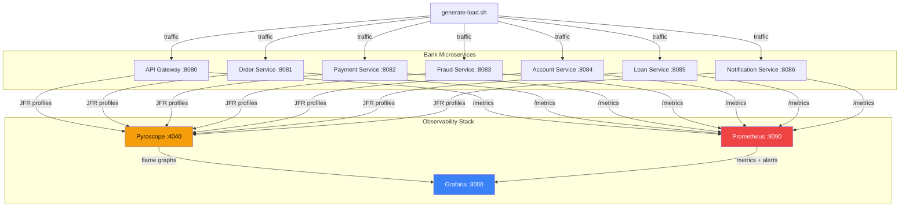

# Pyroscope + Java Vert.x — Zero-Code Continuous Profiling

A bank enterprise microservices demo with **7 Vert.x services** profiled by the **Pyroscope Java agent** — no application code changes required. Integrates with Prometheus, Grafana (4 dashboards), and alert rules.

## TL;DR

```bash
git clone <this-repo> && cd pyroscope
bash scripts/deploy.sh             # builds + starts 10 containers
bash scripts/generate-load.sh 120  # 2 min of traffic to all 7 services
bash scripts/validate.sh           # checks everything works
# Open http://localhost:3000 (admin/admin) → dashboards are pre-loaded
# Open http://localhost:4040 → select any bank-* service → flame graphs
bash scripts/teardown.sh           # clean up
```

## Architecture



## Bank Services

All 7 services are built from the **same Docker image**. The `VERTICLE` environment variable selects which class runs. Pyroscope profiles each one independently.

| Service | Port | Verticle | Pyroscope Name | Profiling Signature |
|---------|------|----------|----------------|---------------------|
| **API Gateway** | 8080 | MainVerticle | `bank-api-gateway` | Recursive fibonacci, batch processing, serialization |
| **Order Service** | 8081 | OrderVerticle | `bank-order-service` | String concatenation, synchronized blocks (lock contention) |
| **Payment Service** | 8082 | PaymentVerticle | `bank-payment-service` | BigDecimal math, SHA-256 hashing, synchronized ledger |
| **Fraud Detection** | 8083 | FraudDetectionVerticle | `bank-fraud-service` | Regex rule engine, statistical analysis, sliding window |
| **Account Service** | 8084 | AccountVerticle | `bank-account-service` | Stream API filtering, BigDecimal interest calc, ConcurrentHashMap |
| **Loan Service** | 8085 | LoanVerticle | `bank-loan-service` | Amortization schedules, Monte Carlo simulation, portfolio aggregation |
| **Notification** | 8086 | NotificationVerticle | `bank-notification-service` | Template rendering (String.format), queue drain loops, exponential backoff |

Each service has deliberately different CPU, memory, and lock characteristics so flame graphs show distinct patterns when compared side by side.

### Service Endpoints

<details>
<summary>API Gateway (:8080) — 17 endpoints</summary>

| Endpoint | Category |
|----------|----------|
| `/cpu` | Recursive Fibonacci |
| `/alloc` | Memory allocation |
| `/slow` | Blocking I/O |
| `/db`, `/mixed` | Combined workloads |
| `/redis/set`, `/redis/get`, `/redis/scan` | Serialization + pattern match |
| `/db/select`, `/db/insert`, `/db/join` | Database simulation |
| `/csv/process` | Data processing |
| `/json/process`, `/xml/process` | Serialization |
| `/downstream/call`, `/downstream/fanout` | HTTP client simulation |
| `/batch/process` | 50K record batch |
</details>

<details>
<summary>Order Service (:8081) — 6 endpoints</summary>

| Endpoint | Category |
|----------|----------|
| `/order/create` | Build order maps (GC pressure) |
| `/order/list` | Iterate + serialize |
| `/order/validate` | Regex validation |
| `/order/process` | Synchronized batch (lock contention) |
| `/order/aggregate` | HashMap group-by |
| `/order/fulfill` | Fan-out orchestration |
</details>

<details>
<summary>Payment Service (:8082) — 6 endpoints</summary>

| Endpoint | Category |
|----------|----------|
| `/payment/transfer` | BigDecimal + SHA-256 signing |
| `/payment/payroll` | Synchronized batch payroll (200-500 employees) |
| `/payment/fx` | Multi-hop currency conversion |
| `/payment/orchestrate` | Fraud→debit→credit→notify fan-out |
| `/payment/history` | Ledger scan + sort |
| `/payment/reconcile` | Re-verify all signatures |
</details>

<details>
<summary>Fraud Service (:8083) — 6 endpoints</summary>

| Endpoint | Category |
|----------|----------|
| `/fraud/score` | Rule engine (8 regex patterns) |
| `/fraud/ingest` | Bulk event ingestion |
| `/fraud/scan` | Scan 10K events against all rules |
| `/fraud/anomaly` | Mean/stddev/percentiles/anomaly detection |
| `/fraud/velocity` | Time-window counting |
| `/fraud/report` | Risk bucket aggregation |
</details>

<details>
<summary>Account Service (:8084) — 8 endpoints</summary>

| Endpoint | Category |
|----------|----------|
| `/account/open` | Create new account |
| `/account/balance` | Lookup balance |
| `/account/deposit`, `/account/withdraw` | Synchronized balance updates |
| `/account/statement` | String.format-heavy statement generation |
| `/account/interest` | 30-day compound interest (BigDecimal loop) |
| `/account/search` | Stream API filter + sort |
| `/account/branch-summary` | Group-by aggregation across 20 branches |
</details>

<details>
<summary>Loan Service (:8085) — 6 endpoints</summary>

| Endpoint | Category |
|----------|----------|
| `/loan/apply` | Weighted credit scoring + decisioning |
| `/loan/amortize` | Full amortization schedule (BigDecimal power) |
| `/loan/risk-sim` | 10K Monte Carlo simulations |
| `/loan/portfolio` | Aggregate 3K loans by type |
| `/loan/delinquency` | Filter + sort delinquent loans |
| `/loan/originate` | Credit→appraisal→underwriting→funding orchestration |
</details>

<details>
<summary>Notification Service (:8086) — 6 endpoints</summary>

| Endpoint | Category |
|----------|----------|
| `/notify/send` | Render template + send |
| `/notify/bulk` | Queue 500-2000 messages |
| `/notify/drain` | Process outbox with 8% failure rate |
| `/notify/render` | Render 200-500 templates (allocation heavy) |
| `/notify/status` | Delivery status aggregation |
| `/notify/retry` | Exponential backoff retry of failed messages |
</details>

## Quick Start

### Option 1: Bash scripts (simplest)

```bash
bash scripts/deploy.sh             # build + start 10 containers
bash scripts/generate-load.sh 120  # generate traffic (default 300s)
bash scripts/validate.sh           # automated health check
bash scripts/teardown.sh           # stop + clean
```

### Option 2: Ansible

```bash
cd ansible
ansible-galaxy collection install community.docker
ansible-playbook -i inventory.yml deploy.yml
ansible-playbook -i inventory.yml generate-load.yml -e duration=120
ansible-playbook -i inventory.yml teardown.yml
```

### Option 3: Terraform

```bash
docker compose build               # build app image first
cd terraform
cp terraform.tfvars.example terraform.tfvars
terraform init && terraform apply
terraform destroy
```

### Postman

Import `postman/pyroscope-demo.postman_collection.json` into Postman
for interactive API exploration. See [postman/README.md](postman/README.md).

**URLs after deploy:**

| Service | URL | Credentials |
|---------|-----|-------------|
| Grafana | http://localhost:3000 | admin / admin |
| Pyroscope | http://localhost:4040 | |
| Prometheus | http://localhost:9090 | |
| API Gateway | http://localhost:8080 | |
| Order Service | http://localhost:8081 | |
| Payment Service | http://localhost:8082 | |
| Fraud Service | http://localhost:8083 | |
| Account Service | http://localhost:8084 | |
| Loan Service | http://localhost:8085 | |
| Notification Service | http://localhost:8086 | |

## Grafana Dashboards

Four pre-provisioned dashboards:

| Dashboard | UID | Description |
|-----------|-----|-------------|
| **Pyroscope Overview** | `pyroscope-java-overview` | CPU/memory/lock flame graphs with application selector for all 7 services |
| **JVM Metrics Deep Dive** | `jvm-metrics-deep-dive` | CPU gauge, heap/non-heap, GC pauses, threads, memory pool utilization |
| **HTTP Performance** | `http-performance` | Request rate, p50/p95/p99 latency, error rate, slowest endpoints |
| **Service Comparison** | `service-comparison` | Side-by-side metrics and flame graphs |

## Prometheus Alert Rules

| Alert | Trigger | Severity |
|-------|---------|----------|
| `HighCpuUsage` | CPU > 80% for 1m | warning |
| `HighHeapUsage` | Heap > 85% for 2m | warning |
| `HighGcPauseRate` | GC > 50ms/s for 1m | warning |
| `HighErrorRate` | 5xx > 5% for 1m | critical |
| `HighLatency` | p99 > 2s for 2m | warning |
| `ServiceDown` | Scrape fails for 30s | critical |

## Documentation

| Document | Description |
|----------|-------------|
| [docs/demo-guide.md](docs/demo-guide.md) | Step-by-step demo script (20-30 min) |
| [docs/runbook.md](docs/runbook.md) | Operations runbook: deploy, verify, incident response, maintenance |
| [docs/sample-queries.md](docs/sample-queries.md) | Copy-paste queries for Pyroscope, Grafana, Prometheus |

## Project Structure

```
pyroscope/
├── ansible/                        # Ansible playbooks
├── config/
│   ├── grafana/dashboards/         # 4 Grafana dashboards (JSON)
│   ├── grafana/provisioning/       # Datasources + dashboard provider
│   ├── prometheus/
│   │   ├── prometheus.yml          # Scrape config for 7 services
│   │   └── alerts.yml             # 6 alert rules
│   └── pyroscope/pyroscope.yaml
├── docs/                           # Demo guide, runbook, sample queries
├── postman/                        # Postman collection + environment
├── sample-app/
│   ├── build.gradle                # Gradle build (shadow plugin)
│   ├── Dockerfile                  # Multi-stage: Gradle → JRE
│   └── src/main/java/com/example/
│       ├── MainVerticle.java       # API Gateway + verticle router
│       ├── OrderVerticle.java      # Order/trade processing
│       ├── PaymentVerticle.java    # Wire transfers, payroll, FX
│       ├── FraudDetectionVerticle.java  # Rule engine, anomaly detection
│       ├── AccountVerticle.java    # Core banking accounts
│       ├── LoanVerticle.java       # Loan origination, amortization
│       ├── NotificationVerticle.java    # Messaging, templates, retries
│       └── handlers/               # 6 additional workload handlers
├── scripts/
│   ├── deploy.sh                   # Build + start + health checks
│   ├── generate-load.sh            # Traffic to all 7 services
│   ├── validate.sh                 # End-to-end automated check
│   └── teardown.sh
├── terraform/                      # Terraform Docker provider
├── docker-compose.yml              # 10 containers (3 infra + 7 services)
└── README.md
```

## How It Works — No Code Changes

The Pyroscope Java agent is attached using `JAVA_TOOL_OPTIONS` in `docker-compose.yml`:

```yaml
environment:
  VERTICLE: payment                  # selects PaymentVerticle
  JAVA_TOOL_OPTIONS: >-
    -javaagent:/opt/pyroscope/pyroscope.jar
    -Dpyroscope.application.name=bank-payment-service
    -Dpyroscope.server.address=http://pyroscope:4040
    -Dpyroscope.format=jfr
    -Dpyroscope.profiler.event=cpu,alloc,lock,wall
    -Dpyroscope.profiler.alloc=512k
    -Dpyroscope.profiler.lock=10ms
    -Dpyroscope.labels.env=production
```

All 7 services use the same Docker image. The `VERTICLE` env var (`order`, `payment`, `fraud`, `account`, `loan`, `notification`) selects which class to run. Default is `MainVerticle`.

### Profile Types

| Profile | Event | What It Shows |
|---------|-------|---------------|
| **CPU** | `cpu` | On-CPU time — which methods consume the most processor cycles |
| **Allocation** | `alloc` | Heap allocations — objects created, GC pressure sources (threshold: 512KB) |
| **Lock** | `lock` | Lock contention — synchronized blocks, ReentrantLock waits (threshold: 10ms) |
| **Wall Clock** | `wall` | Real elapsed time — includes I/O waits, sleeps, off-CPU time |

In Pyroscope UI, select any `bank-*` application, then switch between profile types to see different views of the same service.

### Profiling Overhead Benchmark

Compare application performance with and without the Pyroscope agent:

```bash
bash scripts/benchmark.sh           # 200 requests per endpoint (default)
bash scripts/benchmark.sh 500 100   # 500 requests, 100 warmup
```

This runs each service endpoint twice — once with the agent attached, once without — and reports average latency, p50/p95/p99, throughput, and percentage overhead per service. Results are saved to `benchmark-results/`.

To manually run without profiling:

```bash
# Start without Pyroscope agent
docker compose -f docker-compose.yml -f docker-compose.no-pyroscope.yml up -d

# Start with Pyroscope agent (default)
docker compose up -d
```

## Enterprise Use Cases

### Cost Optimization
Compare CPU profiles across all 7 services. The Payment Service's BigDecimal math and Loan Service's Monte Carlo simulation are intentionally expensive — in production, these are the services where optimization yields the most savings.

### Incident Response
When the Fraud Service p99 spikes, open the flame graph for `bank-fraud-service` and see whether the regex rule engine or the anomaly detection is the bottleneck. See [docs/runbook.md](docs/runbook.md) for full playbooks.

### CI/CD Regression Detection
```bash
curl "http://pyroscope:4040/pyroscope/render?query=process_cpu:cpu:nanoseconds:cpu:nanoseconds%7Bservice_name%3D%22bank-payment-service%22%7D&from=now-1h&until=now&format=json"
```

## Multi-Language Roadmap

| Language | Profiler | Injection Method |
|----------|----------|------------------|
| **Java** (current) | async-profiler via Pyroscope agent | `JAVA_TOOL_OPTIONS=-javaagent:...` |
| **Python** | py-spy | Sidecar: `py-spy record --pid <PID>` |
| **Go** | pprof | `import _ "net/http/pprof"` |
| **Node.js** | perf hooks | `NODE_OPTIONS=--require=pyroscope-node` |

## Troubleshooting

```bash
bash scripts/validate.sh   # automated check
```

See [docs/runbook.md#troubleshooting](docs/runbook.md#troubleshooting) for detailed steps.
