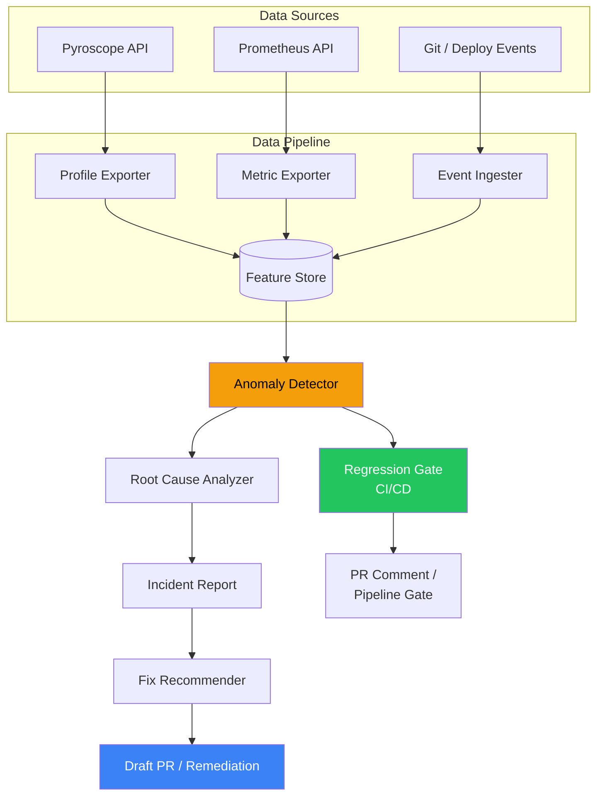

# AI-Assisted Continuous Profiling Roadmap

Phases for applying ML to continuous profiling data: anomaly detection, automated root cause analysis, optimization recommendations, and CI/CD regression gates.

---

## Phase 1: Data Pipeline

Foundation: export profiling data to ML-consumable formats.

- Export Pyroscope profile data via API (`/pyroscope/render` JSON format) into a data lake or feature store
- Normalize flame graph data into tabular features: function name, self-time percentage, call count, allocation bytes, mutex wait time
- Join with Prometheus metrics (CPU, heap, GC, HTTP latency) for correlated feature vectors
- Establish baseline profiles per service per deploy version
- Storage: time-series DB or columnar store (Parquet on S3, ClickHouse, BigQuery)

Produces per-service, per-function feature vectors at regular intervals (e.g., 1-minute granularity).

### Scenario: What this looks like in practice

Today, profiling data is locked inside Pyroscope as flame graphs — a visual tool for humans. The data pipeline turns it into rows that automation can query.

**What Pyroscope stores internally:**
```
main() → handleRequest() → computeHash() → MessageDigest.getInstance()
  samples: 73,000 out of 100,000 total (73% CPU)
```

**What the pipeline produces:**

| timestamp | service | version | function | self_cpu_pct | alloc_bytes | lock_wait_ms | p99_latency | cpu_usage |
|---|---|---|---|---|---|---|---|---|
| 2024-01-15 14:00 | order-svc | v2.3.1 | computeHash | 73% | 12MB | 0ms | 3200ms | 94% |
| 2024-01-15 14:00 | order-svc | v2.3.1 | handleRequest | 8% | 2MB | 15ms | 3200ms | 94% |
| 2024-01-15 14:01 | order-svc | v2.3.1 | serializeResponse | 5% | 8MB | 0ms | 310ms | 42% |

Each row is a **feature vector** — one per function per time interval — combining profile data (from Pyroscope API), metrics (from Prometheus API), and deploy metadata (from CI/CD). A scheduled job calls both APIs, flattens the flame graph tree into per-function rows, joins them, and writes to your data store.

**Why this matters:** Without the pipeline, a human must open Grafana and visually inspect a flame graph during an incident. With it, every subsequent phase (anomaly detection, regression gates, root cause analysis) becomes a query against this table. The pipeline is the foundation everything else builds on.

---

## Phase 2: Anomaly Detection

Detect profile shape changes automatically.

- Statistical methods: compare current function-level CPU/alloc shares against rolling baselines using z-scores or KL divergence
- ML models: train autoencoders or isolation forests on flame graph feature vectors to detect novel execution patterns
- Alert when a function's resource share deviates beyond threshold (e.g., CPU share increased >20% vs 7-day baseline)
- Correlate profile anomalies with metric anomalies (latency spike + new hot function = high confidence alert)
- Reduce alert noise: only fire when both metric AND profile anomalies co-occur

Integration point: Prometheus Alertmanager webhook → profile anomaly enrichment → PagerDuty/Slack.

### Scenario: Catching a regression before customers notice

Your `order-service` gets deployed at 2:11pm. CPU goes from 40% to 65% — not enough to trigger your Prometheus CPU alert (threshold is 80%), so nobody notices. But the pipeline has been writing per-function rows every minute:

```
order-svc | computeHash | self_cpu: 12% | 7-day avg: 11%  ← normal
order-svc | computeHash | self_cpu: 12% | 7-day avg: 11%  ← normal
order-svc | computeHash | self_cpu: 38% | 7-day avg: 11%  ← ANOMALY (3.5x baseline)
```

A simple query catches it:

```sql
SELECT service, function, current_cpu_pct, baseline_avg_cpu_pct
FROM profile_features
WHERE current_cpu_pct > baseline_avg_cpu_pct * 2
  AND timestamp > now() - interval '5 minutes'
```

A Slack alert fires: *"`computeHash()` in order-service jumped from 11% to 38% CPU — started 3 minutes after deploy v2.3.2."*

**Why this is better than a Prometheus alert:** Prometheus tells you "CPU is 65%." The profile anomaly tells you *which function* changed and *when it started relative to a deploy*. The engineer who gets paged already knows where to look before they open Grafana.

**Why this catches things Prometheus misses:** A function going from 11% to 38% is a serious regression, but if overall CPU is still under the alert threshold, Prometheus stays silent. By the time CPU hits 80% and alerts fire, the problem has been in production for hours. Profile-based anomaly detection catches the *shape change* early.

---

## Phase 3: Automated Root Cause Analysis

Given an anomaly, identify the probable root cause.

- Diff flame graphs: compute frame-level deltas between anomalous window and baseline
- Rank functions by delta magnitude (largest increase in self-time = most likely cause)
- Correlate with deployment events (git SHA, config changes) to attribute regressions to specific commits
- Use LLM integration: feed the diff summary (function name, package, delta %, call stack) to an LLM with codebase context to generate a natural-language explanation
- Output: "Function X in service Y increased CPU share by 30% after deploy Z. Call stack shows new code path through method A → B → C."

Integration point: incident management system receives structured root cause reports.

### Scenario: Automated investigation in seconds

The anomaly detector fires at 2:14pm: `computeHash()` in `order-service` spiked to 38% CPU. The root cause analyzer runs automatically:

**Step 1 — Diff the flame graph:**
```
Function             | Baseline (24h avg) | Current  | Delta
computeHash          | 11%                | 38%      | +27%  ← top suspect
serializeResponse    | 5%                 | 6%       | +1%
handleRequest        | 8%                 | 7%       | -1%
everything else      | 76%                | 49%      | -27%
```

**Step 2 — Correlate with deploys:**
```
Deploy v2.3.2 at 14:11 (3 minutes before anomaly onset)
  Commit abc123 by @dev: "Switch hashing from MD5 to SHA-512"
  Files changed: src/main/java/com/app/HashUtil.java
```

**Step 3 — Generate report** (posted to incident channel automatically):

> **Automated Root Cause Report**
> - **Anomaly:** `computeHash()` CPU share increased from 11% → 38% at 14:14
> - **Probable cause:** deploy v2.3.2 at 14:11 — commit `abc123` by @dev changed hashing algorithm from MD5 to SHA-512
> - **Call stack:** `handleRequest → processBatch → computeHash → MessageDigest.digest`
> - **Recommendation:** SHA-512 is ~3x more expensive than MD5 per call. Consider caching digest instances or evaluating whether SHA-256 meets the security requirement at lower cost.

**What normally takes an engineer 1-2 hours** (open Grafana, find the flame graph, diff against baseline, check deploy log, read the git diff) **happened in seconds** with no human involvement. The on-call engineer gets paged with the answer, not the question.

---

## Phase 4: Optimization Recommendations

Suggest code-level fixes based on profiling patterns.

- Pattern library: maintain a catalog of known anti-patterns and their profiling signatures
  - `MessageDigest.getInstance()` in hot path → recommend ThreadLocal caching
  - `Pattern.compile()` per request → recommend static final precompilation
  - `synchronized` method with wide mutex frame → recommend ConcurrentHashMap or lock-free structures
  - `String.format()` in tight loop → recommend StringBuilder
- LLM-powered recommendations: given a flame graph hotspot and source code context, generate specific refactoring suggestions
- Confidence scoring: rank recommendations by expected impact (self-time % × request rate = resource savings)
- PR integration: auto-generate draft PRs with suggested fixes and expected profile impact

### Scenario: From hotspot to fix without human analysis

The root cause analyzer identified `computeHash()` → `MessageDigest.getInstance("SHA-256")` consuming 73% of CPU. The optimization recommender recognizes this pattern:

**Pattern match:**
```
DETECTED: MessageDigest.getInstance() called in hot path
  Location: com.app.HashUtil.computeHash (line 42)
  Frequency: ~500 calls/sec (derived from sample count × request rate)
  CPU impact: 73% of service CPU

KNOWN ANTI-PATTERN: MessageDigest.getInstance() is expensive because
it looks up the provider registry on every call. The MessageDigest
object itself is not thread-safe, but can be cached per-thread.
```

**Generated recommendation:**

> **Optimization: Cache MessageDigest instance with ThreadLocal**
>
> Current code:
> ```java
> public byte[] computeHash(byte[] data) {
>     MessageDigest md = MessageDigest.getInstance("SHA-256");
>     return md.digest(data);
> }
> ```
>
> Suggested fix:
> ```java
> private static final ThreadLocal<MessageDigest> MD_CACHE =
>     ThreadLocal.withInitial(() -> {
>         try { return MessageDigest.getInstance("SHA-256"); }
>         catch (NoSuchAlgorithmException e) { throw new RuntimeException(e); }
>     });
>
> public byte[] computeHash(byte[] data) {
>     MessageDigest md = MD_CACHE.get();
>     md.reset();
>     return md.digest(data);
> }
> ```
>
> **Expected impact:** ~60-70% reduction in `computeHash` CPU time. At current request rates, this would reduce service CPU from 94% to ~35%, potentially allowing pod count reduction from 8 to 3.
>
> **Confidence:** High — this is a well-documented JDK anti-pattern with a proven fix.

The system can auto-generate a draft PR with this change, tagged for human review. The engineer reviews the code, confirms it's correct, and merges. The entire path from "flame graph hotspot" to "PR ready for review" happened without manual analysis.

---

## Phase 5: CI/CD Profile Regression Gates

Prevent performance regressions from reaching production.

- Baseline capture: after each main branch deploy, snapshot per-service profile data
- PR pipeline: deploy candidate build, generate synthetic load, capture profiles
- Automated comparison: diff candidate profiles against baseline using Phase 2 anomaly detection
- Gate criteria: fail pipeline if any function's CPU/alloc share increased beyond threshold
- Report: post profile diff summary as PR comment (function, baseline %, candidate %, delta)
- Artifact storage: archive flame graph snapshots per build for historical comparison

### Scenario: Catching a regression in the PR pipeline

A developer opens PR #421 that changes the response serialization logic. The CI pipeline runs automatically:

**Step 1 — Deploy and load test:**
```
1. Build candidate image from PR branch
2. Deploy to ephemeral test environment
3. Run 30-second load test (synthetic traffic matching production patterns)
4. Capture profiles from Pyroscope during the load test
```

**Step 2 — Compare against baseline:**
```
Function             | Baseline (main) | Candidate (PR #421) | Delta
serializeResponse    | 8%              | 31%                 | +23%  ← REGRESSION
computeHash          | 12%             | 12%                 | 0%
handleRequest        | 15%             | 14%                 | -1%
```

**Step 3 — Post PR comment and fail the build:**

> **Profile Regression Detected — build failed**
>
> | Function | Baseline | Candidate | Delta |
> |----------|----------|-----------|-------|
> | `serializeResponse` | 8% CPU | 31% CPU | **+23%** |
>
> Call stack: `handleRequest → serializeResponse → Jackson.writeValueAsString → JsonGenerator.writeObject`
>
> The serialization change in this PR tripled the CPU cost of response generation. At production traffic levels, this would increase service CPU from 42% to ~65% and likely require additional pods.
>
> To override this gate, add the label `perf-regression-accepted` to the PR.

The regression never reaches production. The developer sees exactly which function regressed and by how much, fixes the serialization approach, pushes an update, and the pipeline passes on the next run.

**Why this matters:** Today, performance regressions are caught *after* they reach production — via alerts, customer complaints, or the next on-call rotation. This is the equivalent of unit tests for performance: catch it in the PR, before it ships.

---

## Phase 6: Autonomous Remediation (Experimental)

Closed-loop: detect, diagnose, and fix without human intervention.

- Scope: limited to well-understood patterns with high-confidence fixes (e.g., JVM flag tuning, thread pool sizing, cache enabling)
- Guardrails: canary deployment, automatic rollback if metrics degrade post-fix
- Human approval gate: autonomous system proposes fix → human approves → system deploys
- Full autonomy (future): for pre-approved fix categories with bounded blast radius

### Scenario: Self-healing thread pool exhaustion

At 3:00am, the anomaly detector fires: `payment-service` lock profiling shows `HikariPool.getConnection` wait time spiked from 2ms to 800ms. The root cause analyzer identifies thread pool exhaustion — 10 connections configured, all blocked waiting on a slow downstream database.

**What the autonomous system does:**

```
1. DETECT:  Lock flame graph shows HikariPool.getConnection at 45% of wall time
            Baseline: 2% of wall time → 22x increase
2. DIAGNOSE: Known pattern — connection pool exhaustion
             Current pool size: 10 (from application config)
             Active connections: 10/10 (all in use)
             Avg query time: 400ms (up from 50ms — downstream DB is slow)
3. DECIDE:  Pre-approved remediation category: "connection pool sizing"
            Action: increase pool size from 10 to 25 (bounded max: 50)
4. APPLY:   Update config via API, rolling restart of 1 canary pod
5. VERIFY:  Wait 2 minutes, compare canary metrics against other pods
            Canary p99: 600ms (down from 3200ms) ✓
            Canary error rate: 0.1% (same as before) ✓
            Canary CPU: 55% (up from 40%, expected with more connections) ✓
6. ROLL OUT: Apply to remaining pods
7. NOTIFY:  Post to #incidents: "Auto-remediated connection pool exhaustion
            in payment-service. Pool size increased 10 → 25. P99 recovered
            from 3200ms to 600ms. Root cause: downstream DB latency increase.
            Recommend investigating DB performance separately."
```

**The 3:00am page never happens.** The on-call engineer wakes up, sees the notification, reviews the change, and follows up on the upstream DB issue during business hours.

**Why this is experimental:** Autonomous remediation is only safe for well-understood, bounded changes (pool sizes, JVM heap flags, cache TTLs). Code changes, architectural changes, or anything without a clear rollback path still requires a human. The system should err heavily on the side of "notify and recommend" over "act autonomously."

---

## Architecture



---

## Business Justification

### Cost of the status quo

Without automation on top of profiling data, the following costs persist even after Pyroscope adoption:

- **Reactive detection only** — regressions that do not immediately breach alert thresholds degrade customer experience for hours or days before a human notices. A function increasing from 11% to 38% CPU is a serious regression trending toward an outage, but threshold-based metric alerts remain silent until overall CPU reaches 80%.
- **Manual investigation per incident** — even with flame graphs available, an engineer must open Grafana, find the right service, select the right time window, diff against baseline, correlate with deploys, and read the git log. This takes 30-60 minutes per incident.
- **No prevention** — without CI/CD profile gates, every performance regression reaches production. The cost is incurred *after* customers are impacted: engineering time, postmortems, SLA risk, and reputation.

### Value by phase

| Phase | Business value | Effort | Annual impact estimate |
|-------|---------------|--------|----------------------|
| **1+2: Data Pipeline + Anomaly Detection** | Catch regressions before they breach alert thresholds or impact customers. Detect profile shape changes that metric-only alerting misses. | 1-2 weeks | 5-10 avoided incidents/year at ~15 eng hours per incident = **75-150 engineering hours saved** + avoided customer impact and SLA risk |
| **5: CI/CD Regression Gates** | Prevent regressions at the source. Performance regressions are caught in the PR pipeline before merge, the same way unit tests catch functional bugs. | 3-4 weeks | 50% reduction in production performance incidents. **100+ engineering hours/year** saved. Zero customer impact from prevented incidents. |
| **3: Root Cause Analysis** | Reduce investigation time from 30-60 minutes to seconds. Structured reports posted to incident channels eliminate the manual diff-and-correlate workflow. | 2-3 weeks | Value scales with incident volume. **20-40 engineering hours/year** for teams with moderate incident load. |
| **4: Optimization Recommendations** | Automated code-level fix suggestions for known anti-patterns. Useful at scale with many services and junior engineers. | 4-6 weeks | Incremental. Experienced engineers recognize most patterns without automation. Justified only for organizations profiling 50+ services. |
| **6: Autonomous Remediation** | Self-healing for well-understood operational patterns (pool sizing, JVM flags, cache TTLs). Reduces after-hours paging. | 8-12 weeks | Narrow scope of safe autonomous actions. Risk of automated production changes requires significant guardrail investment. Justified only at large scale (100+ services). |

### Recommendation

Phases 1, 2, and 5 deliver the highest return on investment and are recommended for implementation:

| Investment | Return |
|-----------|--------|
| 4-6 weeks of engineering effort | Estimated 175-250+ engineering hours saved per year |
| | Majority of performance regressions caught before production |
| | Remaining regressions detected within minutes, not hours |
| | Reduced SLA breach risk and customer-facing impact |
| | Lower on-call burden for performance-related incidents |

Phase 3 (Root Cause Analysis) is a worthwhile follow-on investment for organizations with high incident volume (5+ performance incidents per month). The incremental effort is 2-3 weeks and reduces per-incident investigation time from 30-60 minutes to seconds.

Phases 4 and 6 are not recommended for initial implementation. Phase 4 automates a task that experienced engineers complete in minutes, and the effort to build and maintain a pattern library exceeds the time savings for most organizations. Phase 6 requires significant infrastructure investment (canary deployments, rollback automation, safety guardrails) and carries inherent risk from automated production changes. Both phases may be revisited once the organization reaches a scale where the volume of services and incidents justifies the investment.

### Implementation priorities

| Priority | Phase | Prerequisite | Effort | Recommendation |
|----------|-------|-------------|--------|----------------|
| 1 | Data Pipeline | Pyroscope + Prometheus running | Low | **Build** |
| 2 | Anomaly Detection | Data Pipeline + baseline data | Low | **Build** |
| 3 | CI/CD Regression Gates | Data Pipeline + CI infrastructure | Medium | **Build** |
| 4 | Root Cause Analysis | Anomaly Detection + deploy tracking | Medium | Build if incident volume justifies |
| 5 | Optimization Recommendations | Root Cause Analysis + pattern library | High | Defer |
| 6 | Autonomous Remediation | All above + canary infrastructure | Very High | Defer |

---

## References

- Pyroscope API: `/pyroscope/render`, `/pyroscope/label-values`, `/pyroscope/render-diff`
- Prometheus API: `/api/v1/query`, `/api/v1/query_range`
- This project's CLI tools: `scripts/bottleneck.sh`, `scripts/top-functions.sh`, `scripts/diagnose.sh`
