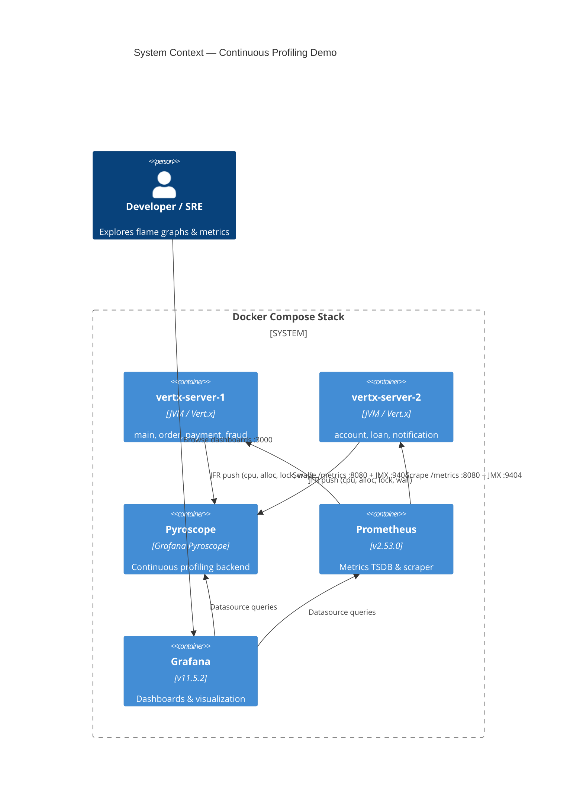
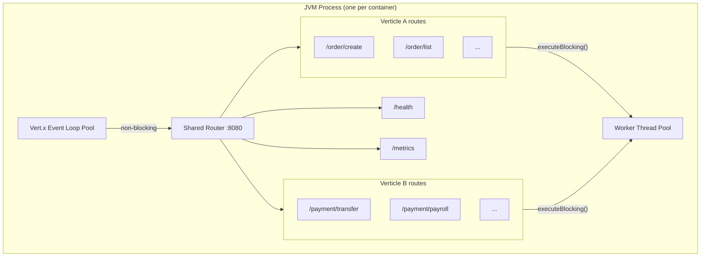
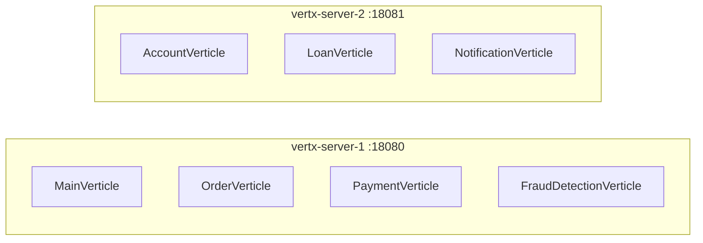
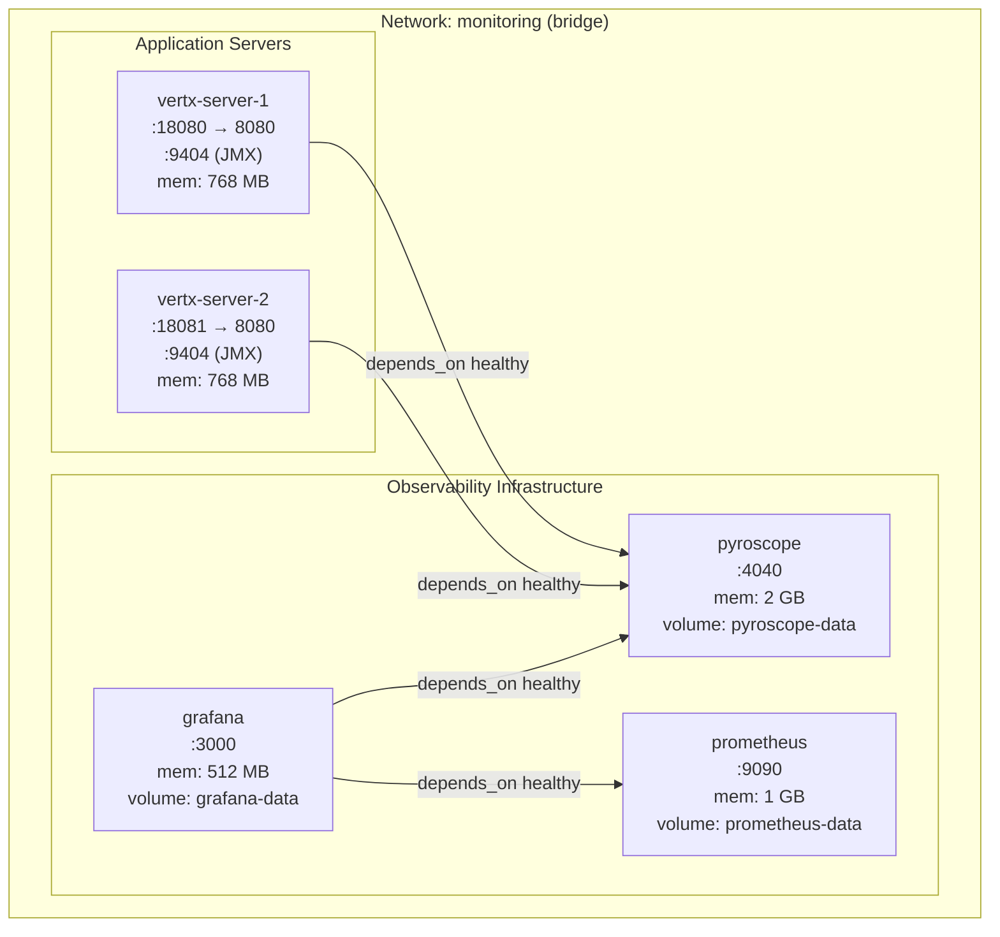
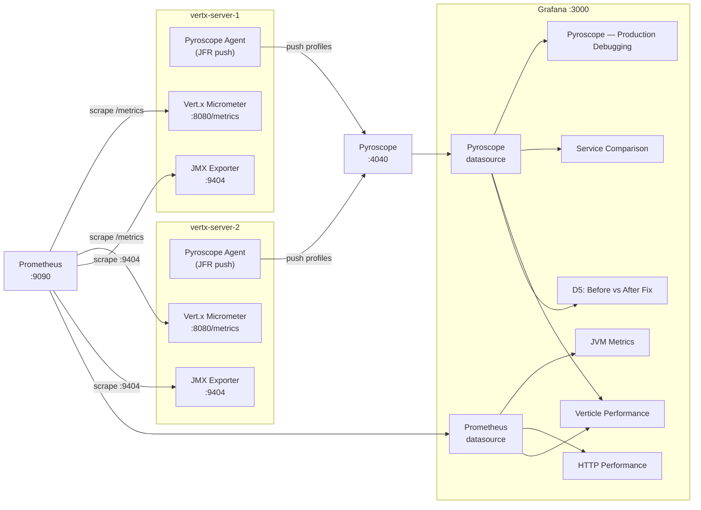

# Architecture & Technical Design

This document covers the deployment topology, application architecture, and observability data flow for the Pyroscope continuous profiling demo.

## 1. System Overview

The project deploys a production-realistic JVM topology with continuous profiling, metrics collection, and dashboarding — ten containers on a single Docker Compose network (7 bank services + 3 observability infrastructure).



## 2. Application Architecture — Vert.x Shared-JVM Model

### How It Works

`MainVerticle.main()` is the single entry point for every server container:

1. Reads the `VERTICLE` env var (e.g. `main,order,payment,fraud`)
2. Creates a shared Vert.x `Router`
3. Registers `/health` and `/metrics` on the shared router
4. Calls `registerRoutes()` on each requested verticle — all routes are mounted on the **same router**
5. Starts **one HTTP server** on port 8080

All verticles run in the same JVM process, sharing the event loop pool and worker thread pool.

### Internal Structure



### Verticle-to-Server Mapping



### Why This Matters for Profiling

Pyroscope sees **one application per server**. Flame graphs show mixed code from all verticles on that server — exactly as in production. To identify which verticle owns a hot frame, look at the package/class in the stack:

- `com.example.OrderVerticle` → Order verticle
- `com.example.PaymentVerticle` → Payment verticle
- `com.example.handlers.*` → MainVerticle enterprise simulation handlers

## 3. Verticle Catalog

| Verticle | Server | Route Prefix | Key Routes | Profile Characteristics |
|----------|--------|-------------|------------|------------------------|
| **MainVerticle** | 1 | `/cpu`, `/alloc`, `/slow`, `/db`, `/mixed`, `/sim/*` | `/cpu` (fibonacci), `/alloc` (buffer churn), `/slow` (sleep), `/sim/redis`, `/sim/db`, `/sim/csv` | CPU, alloc, wall |
| **OrderVerticle** | 1 | `/order/*` | `/order/create`, `/order/process`, `/order/validate`, `/order/aggregate`, `/order/fulfill` | CPU (string parsing, regex), alloc (HashMap), lock (synchronized) |
| **PaymentVerticle** | 1 | `/payment/*` | `/payment/transfer`, `/payment/payroll`, `/payment/fx`, `/payment/reconcile` | CPU (BigDecimal, SHA-256), alloc (ledger), lock (synchronized writes), wall (fan-out) |
| **FraudDetectionVerticle** | 1 | `/fraud/*` | `/fraud/score`, `/fraud/scan`, `/fraud/anomaly`, `/fraud/velocity` | CPU (regex, statistics), alloc (sliding window), wall (large dataset sort) |
| **AccountVerticle** | 2 | `/account/*` | `/account/open`, `/account/deposit`, `/account/withdraw`, `/account/statement`, `/account/interest` | CPU (BigDecimal loops), alloc (ConcurrentHashMap), lock (synchronized deposit/withdraw) |
| **LoanVerticle** | 2 | `/loan/*` | `/loan/apply`, `/loan/amortize`, `/loan/risk-sim`, `/loan/portfolio`, `/loan/originate` | CPU (amortization, Monte Carlo), alloc (BigDecimal objects), wall (orchestration) |
| **NotificationVerticle** | 2 | `/notify/*` | `/notify/send`, `/notify/bulk`, `/notify/drain`, `/notify/render`, `/notify/retry` | CPU (queue drain), alloc (template rendering), wall (exponential backoff) |

## 4. Deployment Architecture

### Docker Compose Topology



### Port Assignment

All host ports are configurable via environment variables with defaults in `docker-compose.yaml`:

| Service | Host Port Variable | Default | Container Port |
|---------|-------------------|---------|----------------|
| Pyroscope | `PYROSCOPE_PORT` | 4040 | 4040 |
| Prometheus | `PROMETHEUS_PORT` | 9090 | 9090 |
| Grafana | `GRAFANA_PORT` | 3000 | 3000 |
| vertx-server-1 | `VERTX_SERVER_1_PORT` | 18080 | 8080 |
| vertx-server-2 | `VERTX_SERVER_2_PORT` | 18081 | 8080 |

`scripts/deploy.sh` auto-resolves port conflicts by scanning used ports and writing overrides to `.env`.

### Container Configuration

| Service | `mem_limit` | Health Check | `depends_on` |
|---------|------------|-------------|--------------|
| pyroscope | 2 GB | `curl /ready` | — |
| prometheus | 1 GB | `curl /-/ready` | — |
| grafana | 512 MB | `curl /api/health` | prometheus (healthy), pyroscope (healthy) |
| vertx-server-1 | 768 MB | `curl /health` | pyroscope (healthy) |
| vertx-server-2 | 768 MB | `curl /health` | pyroscope (healthy) |

## 5. Observability Data Flow



### Three Telemetry Pipelines

| Pipeline | Agent | Transport | Backend | What It Captures |
|----------|-------|-----------|---------|-----------------|
| **Continuous Profiling** | Pyroscope Java agent (JFR) | Push to `:4040` | Pyroscope | CPU, alloc, lock, wall flame graphs |
| **JVM Metrics** | JMX Exporter agent (`:9404`) | Prometheus scrape | Prometheus | Heap, GC, threads, CPU, classloading |
| **Application Metrics** | Vert.x Micrometer (`:8080/metrics`) | Prometheus scrape | Prometheus | HTTP request rate, latency, status codes |

### Reading Mixed Flame Graphs

Since multiple verticles share a JVM, flame graphs show interleaved stacks. To isolate verticle behavior:

1. **By class name** — look for `com.example.OrderVerticle`, `com.example.PaymentVerticle`, etc. in the stack
2. **By route handler** — Vert.x router frames will show the registered path
3. **By Pyroscope labels** — the `server` label (`vertx-server-1` / `vertx-server-2`) identifies which group of verticles is running

## 6. Configuration Reference

### JAVA_TOOL_OPTIONS Breakdown

Each Vert.x server container sets `JAVA_TOOL_OPTIONS` with two Java agents:

```
# Pyroscope agent — continuous profiling via JFR
-javaagent:/opt/pyroscope/pyroscope.jar
-Dpyroscope.application.name=vertx-server-1       # Application name in Pyroscope UI
-Dpyroscope.server.address=http://pyroscope:4040   # Push target
-Dpyroscope.format=jfr                             # JDK Flight Recorder format
-Dpyroscope.profiler.event=itimer                   # CPU profiling event (alloc/lock enabled by their own flags)
-Dpyroscope.profiler.alloc=512k                    # Allocation sampling interval
-Dpyroscope.profiler.lock=10ms                     # Lock contention threshold
-Dpyroscope.labels.env=production                  # Static label
-Dpyroscope.labels.server=vertx-server-1           # Static label for filtering
-Dpyroscope.log.level=info

# JMX Exporter — JVM metrics as Prometheus endpoint
-javaagent:/opt/jmx-exporter/jmx_prometheus_javaagent.jar=9404:/opt/jmx-exporter/config.yaml
```

### OPTIMIZED Environment Variable

Toggles between deliberately slow and optimized code paths for before/after flame graph comparison:

| Value | Behavior |
|-------|----------|
| `true` | Use optimized implementations (iterative fibonacci, ThreadLocal MessageDigest, lock-free processing, primitive arrays, StringBuilder templates) |
| unset or other | Use original slow implementations (recursive fibonacci, synchronized blocks, per-call getInstance, boxed collections, String.format) |

Set via `docker-compose.fixed.yaml` override or `--fixed` flag in `scripts/run.sh`. The default pipeline runs both phases automatically.

### VERTICLE Environment Variable

Comma-separated list of verticle names to deploy on this server:

| Value | Behavior |
|-------|----------|
| `main,order,payment,fraud` | Deploy those four verticles |
| `account,loan,notification` | Deploy those three verticles |
| `all` | Deploy all seven verticles |
| `main` (default) | Deploy MainVerticle only |

Valid names: `main`, `order`, `payment`, `fraud`, `account`, `loan`, `notification`.

### Docker Compose Services

| Service | Image | Build | Volumes |
|---------|-------|-------|---------|
| pyroscope | `grafana/pyroscope:latest` | — | `pyroscope-data:/data`, `config/pyroscope/pyroscope.yaml` |
| prometheus | `prom/prometheus:v2.53.0` | — | `prometheus-data:/prometheus`, `config/prometheus/prometheus.yaml`, `alerts.yaml` |
| grafana | `grafana/grafana:11.5.2` | — | `grafana-data:/var/lib/grafana`, provisioning config, dashboard JSONs |
| vertx-server-1 | — | `./sample-app/Dockerfile` | — |
| vertx-server-2 | — | `./sample-app/Dockerfile` | — |
