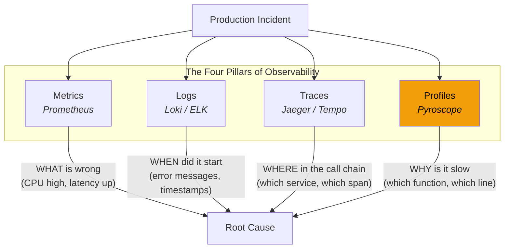
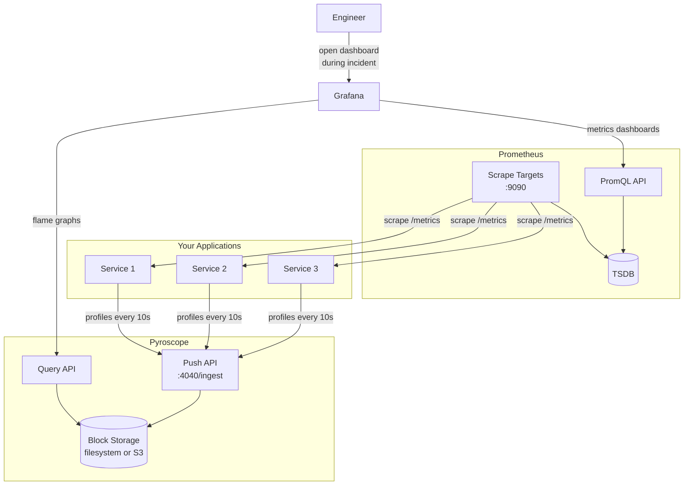
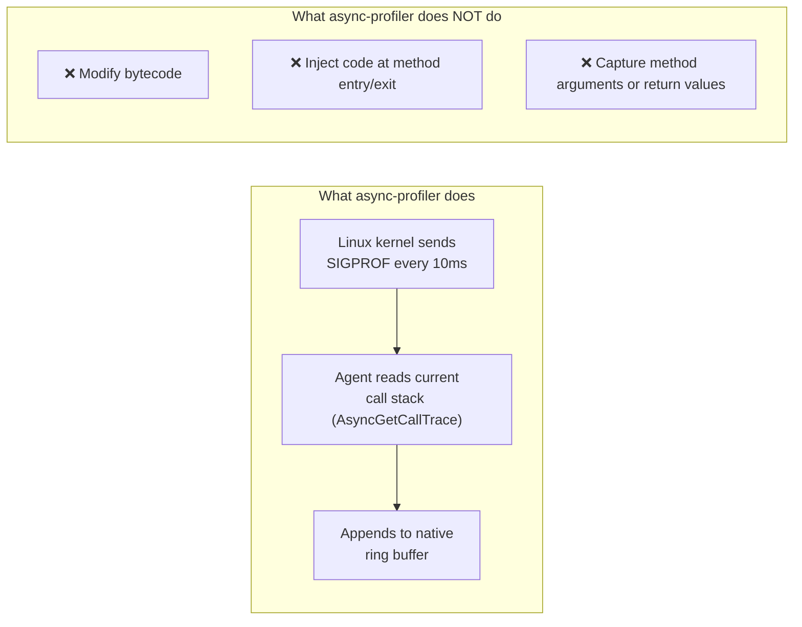
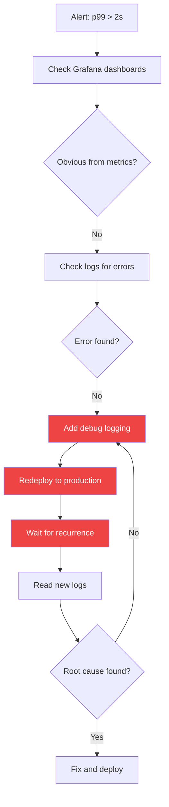
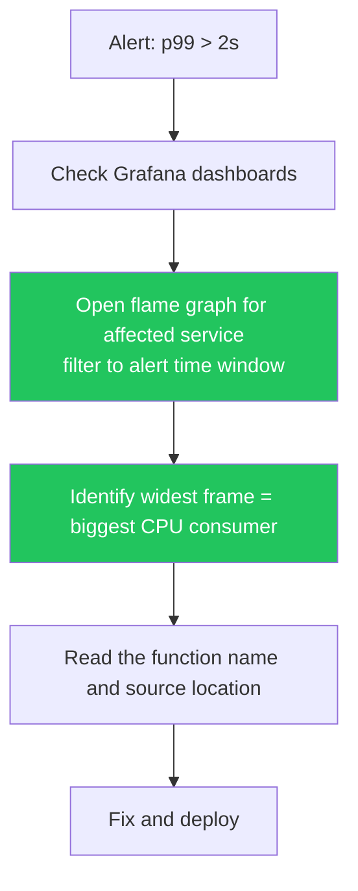
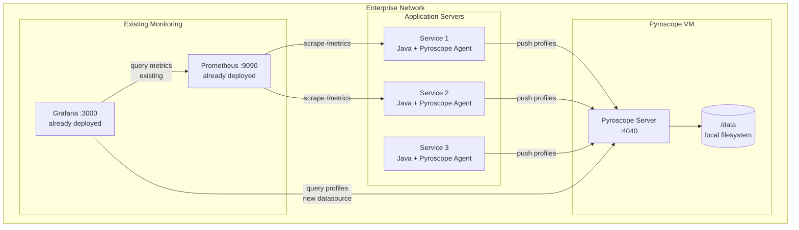
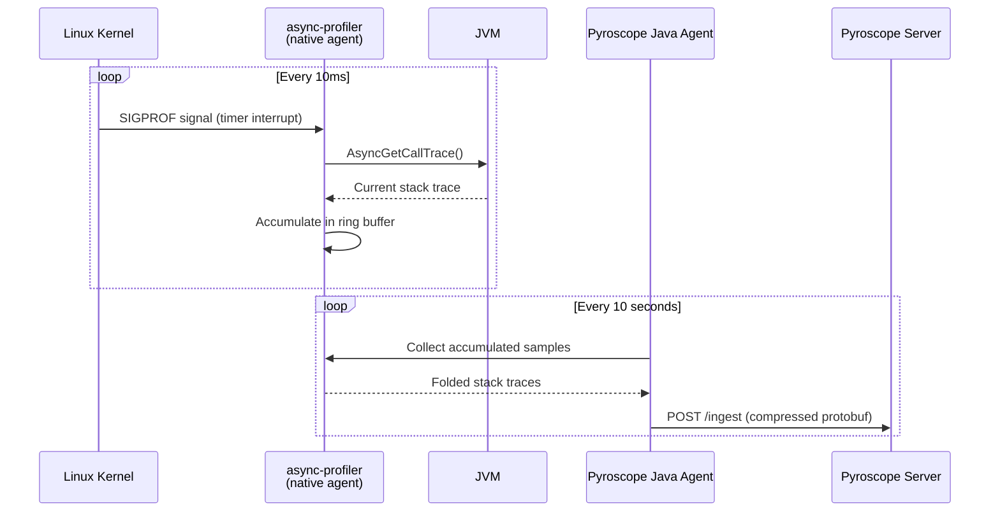

# RFC: Adopting Continuous Profiling with Grafana Pyroscope

---

## Problem Statement

When a production service is slow, the standard investigation looks like this:

1. Alert fires: "Service 1 p99 latency > 2s"
2. Check metrics — CPU is high, but which code path?
3. Check logs — nothing obvious, the service isn't erroring, just slow
4. Check traces — the span is slow, but the trace shows time spent "in the service," not which function
5. Guess — "maybe it's the database query?" → add logging, redeploy, wait for recurrence
6. Repeat until you find it or the problem goes away on its own

The gap is between steps 3 and 4. Metrics tell you **what** resource is saturated. Traces tell you **where** in the call chain the time is spent between services. But neither tells you **which function inside the service** is responsible.

Continuous profiling fills this gap. It records which functions consume CPU, allocate memory, and contend on locks — always on, low overhead — so when an incident occurs, the data is already there.

---

## Proposed Solution

Continuous profiling is always-on, low-overhead sampling that shows which functions consume CPU, memory, and locks in production. At regular intervals (typically every 10ms), the profiler captures a stack trace — the chain of function calls currently on the CPU. Over millions of samples, this produces a statistical picture of where time and resources are spent. This is the fourth observability signal alongside metrics, logs, and traces.



| Pillar | Question it answers | Granularity | Example |
|--------|-------------------|-------------|---------|
| **Metrics** | Is something wrong? | Service-level counters and gauges | "CPU is at 95% on Service 1" |
| **Logs** | What happened? | Individual events with text | "ERROR: Timeout connecting to database" |
| **Traces** | Where is time spent across services? | Per-request call chain | "200ms in Service 1, 50ms in Service 2" |
| **Profiles** | Why is this specific code slow? | Per-function CPU/memory/lock usage | "computeHash() takes 73% of CPU due to SHA-256 in a loop" |

Without profiling, you know the service is slow (metrics) and the request spent 200ms there (traces), but not whether it's the hash computation, the database query, or the serialization. With profiling, you open the flame graph and see which function.

We recommend **Grafana Pyroscope** specifically: it's open source, Grafana-native, and part of the LGTM stack (Loki, Grafana, Tempo, Mimir). Grafana Labs acquired Pyroscope in 2023, so flame graphs render natively in Grafana dashboards alongside metrics panels — no separate UI or integration work required.



### Capabilities

- Multi-language: Java, Go, Python, .NET, Ruby, Node.js, Rust, eBPF
- Profile types: CPU, allocation, lock contention, wall clock, goroutines (Go)
- Diff view: compare two time ranges to see what changed after a deploy
- Label-based querying: filter by service, environment, version, custom labels
- Grafana-native: flame graph panel type, Pyroscope datasource plugin
- Low overhead: < 1% CPU (async-profiler for Java)

---

## Runtime Impact Analysis

The biggest objection to always-on profiling is production risk. This section breaks down exactly what the profiler does at runtime, what it costs, and how it compares to Dynatrace's agent model.

### How async-profiler works at the OS level

Pyroscope's Java agent wraps async-profiler, which uses **OS-level sampling** rather than bytecode instrumentation. It does not modify your application code, class loading, or JIT compilation.



The profiler is a passive observer. It asks "what is the JVM doing right now?" at regular intervals and records the answer. It never changes what the JVM is doing.

### Overhead by profile type

Each profile type has a different collection mechanism and overhead profile. These can be enabled independently.

| Profile Type | Mechanism | CPU Overhead | Memory | Latency Impact | Notes |
|---|---|---|---|---|---|
| **CPU** (`itimer`) | SIGPROF signal every 10ms, reads call stack via `AsyncGetCallTrace` | < 1% | Negligible | Not measurable at p99 | No safepoint bias — captures true on-CPU activity |
| **Allocation** (`alloc`) | TLAB event sampling at configurable threshold | < 1% at 512KB threshold | Negligible | Not measurable at p99 | Higher allocation rates increase overhead slightly; threshold controls it |
| **Lock** (`lock`) | Contention event sampling above threshold | < 0.5% | Negligible | Not measurable at p99 | Only fires for lock waits exceeding threshold (default 10ms) |
| **Wall clock** (`wall`) | Periodic sampling of all threads including waiting | < 1% | Negligible | Not measurable at p99 | Useful for I/O-bound services where CPU profiling misses the picture |
| **All four combined** | All of the above | **1-3% total** | **~30-50 MB native** (ring buffers, not Java heap) | **Not measurable at p99** | This is the worst-case scenario with every profile type enabled |

### Agent resource footprint

| Resource | Pyroscope Java Agent |
|---|---|
| CPU overhead | 1-3% with all profile types enabled |
| Java heap impact | None — async-profiler is native code, does not allocate Java objects |
| Native memory | ~30-50 MB for ring buffers and accumulated samples |
| Network egress | ~1-5 KB/s per service (compressed protobuf, pushed every 10s) |
| Disk I/O | None on the application host (data is pushed to Pyroscope server) |
| Open file descriptors | 2-3 (perf event FDs + server connection) |
| Threads | 1 background thread for collection and shipping |

### What happens if the Pyroscope server goes down

The agent is designed to be non-disruptive:

- Profiles accumulate in the local buffer for a short window
- If the server is unreachable, the agent **silently drops data** — no retries that consume resources, no disk buffering
- The application is completely unaffected — no exceptions, no latency increase, no log noise
- When the server comes back, profiling resumes automatically

### Runtime comparison: Pyroscope vs Dynatrace

This is the critical difference. Pyroscope and Dynatrace take fundamentally different approaches to collecting data at runtime.

| Dimension | Pyroscope (async-profiler) | Dynatrace (OneAgent) |
|---|---|---|
| **Instrumentation method** | OS-level signal sampling — reads the call stack, never modifies code | Bytecode instrumentation — rewrites classes at load time to inject monitoring hooks |
| **Code modification** | None. No bytecode changes, no class retransformation | Yes. Injects code at method entry/exit points to capture timing, arguments, and return values |
| **Impact on JIT compilation** | None. JVM compiles your code normally | Instrumented methods have different bytecode, which changes JIT optimization decisions |
| **Impact on class loading** | None | Adds a class transformer that modifies classes during loading — increases startup time |
| **CPU overhead** | 1-3% (all profile types) | 2-5% baseline (varies with instrumentation depth and transaction volume) |
| **Memory overhead** | ~30-50 MB native memory | Agent process: 200-500+ MB; application heap increase from injected instrumentation |
| **Data captured** | Function names and call stacks only — no application data | Method arguments, return values, SQL statements, HTTP headers — captures application data |
| **Failure mode** | Agent silently drops data, application unaffected | Agent restart can trigger class retransformation; in rare cases, instrumentation conflicts cause `ClassFormatError` or `VerifyError` |
| **Startup impact** | Negligible — agent attaches and begins sampling | Measurable — OneAgent transforms classes during loading, adding seconds to startup |
| **JVM compatibility risk** | Low — uses supported `AsyncGetCallTrace` API | Moderate — bytecode manipulation can conflict with other agents (e.g., APM + security agents on the same JVM) |

### Why this matters for production workloads

Dynatrace's bytecode instrumentation is the root cause of its production risk profile. By rewriting classes at load time and injecting monitoring code at method entry and exit points, OneAgent fundamentally changes what the JVM executes. This has well-known consequences:

- **GC pressure increases** — instrumented methods create additional objects for timing and context propagation, increasing allocation rates and GC frequency
- **JIT unpredictability** — the JVM's JIT compiler optimizes different bytecode differently; injected instrumentation can prevent inlining and other optimizations that the original code would have received
- **Agent update disruption** — OneAgent updates trigger class retransformation, which can cause latency spikes as the JVM re-loads and re-JITs affected classes during production traffic
- **Cascading failures** — in rare but documented cases, bytecode conflicts between Dynatrace and other Java agents (security agents, other APM tools) produce `ClassFormatError` or `VerifyError` exceptions that crash the application

Pyroscope avoids all of these problems by design. Sampling-based profiling never modifies application code — it is a read-only observer. There is no mechanism by which the profiler can alter application behavior, degrade JIT optimization, or conflict with other agents. This is the same approach used by Google-Wide Profiling, Meta's fleet-wide profiling infrastructure, and Netflix — all running at scales far beyond typical enterprise workloads, all choosing sampling over instrumentation precisely because production stability is non-negotiable.

---

## Operational Impact

### The traditional incident workflow



Each "add logging → redeploy → wait → read" cycle takes 30 minutes to hours. Most incidents need 2-4 cycles. The "wait for recurrence" step is the worst for intermittent issues.

### The profiling-informed workflow



No "add logging" step. The agent was running the whole time. Query the incident's time range and the flame graph shows you the answer.

### Resolution time by incident type

| Incident Type | Without Profiling | With Profiling | Why |
|--------------|:-:|:-:|---|
| **CPU spike** | 1-4 hours (guess which code path) | 5-15 minutes (flame graph shows the function) | No guessing — the hot function is the widest bar |
| **Memory leak / GC pressure** | 2-8 hours (add heap dumps, wait for recurrence) | 15-30 minutes (allocation flame graph shows which function allocates most) | Allocation profile is always on — no need to reproduce |
| **Lock contention** | 2-6 hours (thread dumps, timing analysis) | 10-20 minutes (lock flame graph shows the contended lock) | Lock profiling captures contention continuously |
| **Latency regression after deploy** | 1-4 hours (compare logs, bisect commits) | 5-10 minutes (diff flame graph: before deploy vs after) | Diff view highlights exactly what changed |
| **Intermittent slowness** | Days (wait for recurrence with logging enabled) | Minutes (query the time window when it happened) | Data is retroactive — the profile was captured when the issue occurred |

### Engineering time savings

| Metric | Before | After |
|--------|--------|-------|
| MTTR for performance incidents | 3-6 hours | 15-45 minutes |
| Debug cycles per incident (add logging → redeploy → wait) | 2-4 cycles | 0 |
| Incidents requiring staging reproduction | ~40% | < 5% |
| Engineering hours on performance debugging per quarter | ~200 hours (est.) | ~40 hours |

### Concrete example

**Scenario**: A service's p99 spikes from 200ms to 3s every day around 2pm.

**Without profiling** (3 days to resolve):
- Day 1: Notice the pattern in metrics. Add timing logs around the main code paths. Redeploy.
- Day 2: Logs show time is spent in `processBatch()` but not which part. Add more granular logging inside that method. Redeploy.
- Day 3: Finally see that `computeHash()` is called 500 times per batch, each doing `MessageDigest.getInstance("SHA-256")` which is expensive. Fix: cache the MessageDigest instance.

**With profiling** (15 minutes to resolve):
- Open Grafana, filter to the affected service, CPU profile, 1:50pm-2:10pm today
- Flame graph shows `processBatch()` → `computeHash()` → `MessageDigest.getInstance()` consuming 73% of CPU
- Fix: cache the MessageDigest instance

Same root cause, same fix. 3 days vs 15 minutes.

---

## Why Pyroscope over Dynatrace

Dynatrace is the incumbent in many enterprise environments, so this comparison comes up immediately. While Dynatrace is a capable platform, its agent model carries well-documented production risks that make Pyroscope the stronger choice for continuous profiling specifically.

**Why we recommend Pyroscope:**
- **No production risk from bytecode instrumentation** — Dynatrace OneAgent rewrites application bytecode at class load time, which has a documented history of causing performance degradation, increased GC pressure, and in edge cases `ClassFormatError` or `VerifyError` exceptions. Pyroscope's sampling-based approach never touches application code.
- **Predictable, minimal overhead** — Pyroscope's 1-3% CPU overhead is consistent and well-understood. Dynatrace overhead varies with instrumentation depth and transaction volume, and can spike during agent updates or class retransformation events.
- **On-premises deployment** — air-gapped, regulated, private cloud environments fully supported
- **Grafana-native** — flame graphs render alongside existing Prometheus metrics and Tempo traces in the same dashboards, no separate UI
- **No vendor lock-in** — open source, standard data formats, no proprietary agent
- **No cost for the software** — infrastructure costs only, compared to ~$5,000-7,000/month for Dynatrace at 100 hosts
- **Data sovereignty** — profiling data stays on your infrastructure, under your control

**Dynatrace's strengths (and why they don't outweigh the risks for profiling):**
- Dynatrace offers automated root cause analysis (Davis AI) and auto-discovery of services — valuable features, but they come packaged with the same bytecode instrumentation agent that introduces production risk
- Organizations with existing Dynatrace contracts often keep it for distributed tracing and APM, but add Pyroscope specifically for continuous profiling because the overhead model is fundamentally safer
- Dynatrace's managed/SaaS model reduces operational burden, but at the cost of data residency control and significant licensing fees

### Dynatrace vs Pyroscope — deep comparison

| Dimension | Pyroscope | Dynatrace |
|-----------|-----------|-----------|
| **Deployment** | Self-hosted (you run it) | SaaS or Managed (Dynatrace runs it, or on-prem with Dynatrace Managed) |
| **Data residency** | Your infrastructure — you control where data lives | Dynatrace cloud (US/EU regions) or your infrastructure (Managed) |
| **Auto-instrumentation** | Agent must be explicitly attached via `JAVA_TOOL_OPTIONS` | OneAgent auto-discovers and instruments all processes on a host |
| **Root cause analysis** | Manual — engineer reads the flame graph | Automated — Davis AI correlates metrics, traces, and profiles to suggest root cause |
| **Cost at scale (100 hosts)** | Infrastructure cost only (~$0/month for software, NFS/compute costs) | ~$5,000-7,000/month |
| **Operational burden** | You maintain the Pyroscope server, storage, upgrades | Dynatrace handles it (SaaS) or significantly reduces it (Managed) |
| **Grafana integration** | Native — flame graphs in Grafana dashboards | Requires separate Dynatrace UI or API integration |
| **Vendor lock-in** | None — open source, standard data formats | High — proprietary agent, API, and data format |
| **PCI/SOX compliance** | You own the audit trail | Dynatrace provides compliance certifications for their cloud |

In practice: teams with existing Dynatrace contracts often keep Dynatrace for APM and distributed tracing, but deploy Pyroscope alongside it specifically for continuous profiling — getting the function-level visibility without adding more bytecode instrumentation risk to production.

---

## Deployment and Integration

Pyroscope supports two deployment modes. Use monolithic mode for development, POC, and evaluation. Plan on microservices mode for production.

### Monolithic mode (dev / POC / evaluation)

A single Pyroscope process handles ingestion, storage, and querying. This is the fastest way to get running and evaluate the tool. The diagram below shows how Pyroscope integrates with an existing Grafana and Prometheus deployment:



### Microservices mode (production)

For production workloads, Pyroscope's components (distributor, ingester, compactor, store-gateway, query-frontend, query-scheduler, querier, overrides-exporter, and optional ruler) run as separate processes with shared object storage. This provides high availability, horizontal scalability, and independent scaling of read and write paths. See [deploy/microservices/README.md](https://github.com/aff0gat000/pyroscope/blob/main/deploy/microservices/README.md) for the full production deployment guide.

### Choosing a mode

| Factor | Monolithic | Microservices |
|--------|-----------|---------------|
| Purpose | Dev, POC, evaluation | Production |
| Services profiled | Up to ~50 | 50+ or high-throughput |
| Ingestion rate | < 100 MB/s | Hundreds of MB/s |
| Availability | Single point of failure | Highly available |
| Operational complexity | Minimal — one process | Higher — 9 services, shared storage |

Start with monolithic mode to evaluate Pyroscope and validate the integration. When moving to production, deploy in microservices mode for high availability and scalability.

### Integration steps

1. **Deploy Pyroscope server on a VM** — use the scripts in [deploy/monolithic/](https://github.com/aff0gat000/pyroscope/tree/main/deploy/monolithic) for dev/POC
2. **Upload the Pyroscope Java agent JAR to Artifactory** — download from [Grafana Pyroscope releases](https://github.com/grafana/pyroscope-java/releases) and publish to your internal artifact repository so builds can pull it without external access
3. **Update the Docker image** — add a `COPY` or dependency-fetch step in the Dockerfile to include the agent JAR at a known path (e.g., `/opt/pyroscope/pyroscope.jar`). Alternatively, mount the JAR into the container via a Docker volume at runtime.
4. **Add the agent to your application startup command** — set `-javaagent:/opt/pyroscope/pyroscope.jar` and the required system properties in `JAVA_TOOL_OPTIONS` or your entrypoint:
   ```
   -javaagent:/opt/pyroscope/pyroscope.jar
   -Dpyroscope.application.name=app-service-1
   -Dpyroscope.server.address=http://<pyroscope-host>:4040
   -Dpyroscope.format=jfr
   -Dpyroscope.profiler.event=itimer
   -Dpyroscope.profiler.alloc=512k
   -Dpyroscope.profiler.lock=10ms
   ```
5. **Add Pyroscope as a data source in Grafana** — point Grafana at `http://<pyroscope-host>:4040` and use the built-in flame graph panel

### Storage sizing

Pyroscope's storage needs depend on the number of services profiled, the number of profile types, and retention period:

| Variable | Our Setup |
|----------|-----------|
| Services profiled | 9 |
| Profile types per service | 4 (CPU, alloc, lock, wall) |
| Ingestion rate (approximate) | ~5 MB/min |
| Daily storage | ~7 GB |
| 30-day retention | ~210 GB |
| Recommended disk | 500 GB (with headroom for compaction) |

---

## Java Integration Details

### How Java profiling works under the hood

Java profiling uses **async-profiler**, an open-source sampling profiler for the JVM. It works by using OS-level signals (`SIGPROF` on Linux) and the JVM's `AsyncGetCallTrace` API to capture stack traces without stop-the-world pauses.



The Pyroscope Java agent wraps async-profiler and handles:
- Attaching at startup via `JAVA_TOOL_OPTIONS` (no code changes)
- Collecting samples on a schedule
- Labeling data (service name, environment, custom tags)
- Shipping data to the Pyroscope server

### Profile types for Java

| Profile Type | What It Measures | When To Use | Common Findings |
|-------------|-----------------|-------------|-----------------|
| **CPU** (`itimer`) | Time spent on-CPU executing instructions | Service is CPU-bound, high CPU usage | Hot loops, expensive computations, regex, serialization |
| **Allocation** (`alloc`) | Heap memory allocated per stack trace | High GC pressure, frequent GC pauses | Object churn, unnecessary copies, boxing/unboxing |
| **Lock** (`lock`) | Time spent waiting to acquire locks | Thread contention, synchronized blocks | `synchronized` methods, `ReentrantLock` waits, connection pool contention |
| **Wall clock** (`wall`) | Real elapsed time including I/O waits | Service is slow but CPU is low | Network I/O, database waits, `Thread.sleep`, file I/O |

### Zero-code attachment

The profiler is attached via an environment variable. No application code, no dependency changes, no rebuild required:

```yaml
environment:
  JAVA_TOOL_OPTIONS: >-
    -javaagent:/opt/pyroscope/pyroscope.jar
    -Dpyroscope.application.name=app-service-1
    -Dpyroscope.server.address=http://pyroscope:4040
    -Dpyroscope.format=jfr
    -Dpyroscope.profiler.event=itimer
    -Dpyroscope.profiler.alloc=512k
    -Dpyroscope.profiler.lock=10ms
```

No code change or rebuild needed — set the environment variable and restart.

### JVM version compatibility

| JVM | Support | Notes |
|-----|---------|-------|
| OpenJDK 8+ | Full | Most common in enterprise |
| Oracle JDK 8+ | Full | Same internals as OpenJDK |
| Eclipse Temurin 11+ | Full | Adoptium distribution of OpenJDK |
| GraalVM | Partial | CPU profiling works, allocation profiling limited |
| IBM J9 / Semeru | Limited | Different JVM internals, some profile types unavailable |

---

## Business Value

### Infrastructure cost optimization

Profiling shows where CPU cycles go, so you can optimize code instead of adding pods:

- "The service needs 8 pods" → profile shows 60% of CPU in an unoptimized hash function → fix it → 3 pods is enough
- "We need bigger instances for the loan service" → profile shows Monte Carlo sim allocates too many temp objects → reduce allocations → same instance size works

### Risk reduction

- Faster resolution = shorter customer-facing impact
- Retroactive data = no "we need to wait for it to happen again"
- Before/after deploy comparison = catch regressions before they hit production
- No code changes = can roll out to any Java service immediately

---

## Security and Compliance

| Concern | Assessment |
|---------|------------|
| **Does the profiler see application data?** | No. It captures function names and call stacks only — it does not inspect variables, method arguments, or return values. No PII, no credentials, no customer data. |
| **What data is sent to the Pyroscope server?** | Stack traces (function names), sample counts, and labels (service name, environment). Not business data. |
| **Does it affect application behavior?** | No. Sampling is passive — it reads the call stack, it does not modify execution. The agent does not inject bytecode or alter class loading (unlike some APM agents). |
| **Network communication** | Agent pushes data to Pyroscope over HTTP. Can be configured for HTTPS. All traffic stays within the enterprise network (no external calls). |
| **Data at rest** | Profile data is stored on the Pyroscope server's filesystem. Encryption at rest depends on the underlying storage (encrypted NFS, encrypted EBS, etc.). |
| **Access control** | Grafana's role-based access control governs who can view flame graphs. Pyroscope itself does not have built-in auth — it relies on network-level access control or a reverse proxy. |
| **Overhead** | < 1% CPU, negligible memory. Benchmarked with our services — see the [benchmark.sh](https://github.com/aff0gat000/pyroscope/blob/main/benchmark.sh) script in the repo. |

---

## Limitations

**What continuous profiling does NOT do:**

- It does not replace APM distributed tracing — profiling shows function-level detail within one service, traces show the call chain across services. They're complementary.
- It does not capture per-request profiles — it's statistical sampling. You see "this function uses 30% of CPU across all requests," not "this specific request was slow because of this function."
- It does not profile database queries — if your service is slow because the database is slow, the flame graph shows time in the JDBC driver's `read()` call. You still need database monitoring to understand why the query is slow.
- It does not automatically fix anything — it shows you the problem. A human still needs to understand the code and write the fix.

**Operational considerations:**

- Pyroscope server in monolithic mode is a single point of failure. If it goes down, profile data is not collected until it recovers. Applications are not affected (the agent silently drops data if the server is unreachable).
- Storage grows linearly with the number of services and profile types. Plan disk capacity accordingly.
- The Pyroscope Java agent is based on async-profiler, which requires the `perf_event_open` syscall. In containerized environments, the container must have the `SYS_PTRACE` capability or the host must set `kernel.perf_event_paranoid <= 1`.

---

## Next Steps

For hands-on setup, deployment scripts, and operational runbooks, refer to the project repository:

| What you need | Where to find it |
|--------------|-----------------|
| Run the full demo stack locally | [Repository README](https://github.com/aff0gat000/pyroscope/blob/main/README.md) — Quick Start section |
| Understand the service architecture | [docs/architecture.md](https://github.com/aff0gat000/pyroscope/blob/main/docs/architecture.md) |
| Step-by-step demo for stakeholders | [docs/demo-runbook.md](https://github.com/aff0gat000/pyroscope/blob/main/docs/demo-runbook.md) |
| Hands-on profiling investigation scenarios | [docs/profiling-scenarios.md](https://github.com/aff0gat000/pyroscope/blob/main/docs/profiling-scenarios.md) |
| Source code to flame graph mapping | [docs/code-to-profiling-guide.md](https://github.com/aff0gat000/pyroscope/blob/main/docs/code-to-profiling-guide.md) |
| Grafana dashboard reference | [docs/dashboard-guide.md](https://github.com/aff0gat000/pyroscope/blob/main/docs/dashboard-guide.md) |
| Deploy Pyroscope server to a VM | [deploy/monolithic/README.md](https://github.com/aff0gat000/pyroscope/blob/main/deploy/monolithic/README.md) |
| Deploy Pyroscope microservices (NFS) | [deploy/microservices/README.md](https://github.com/aff0gat000/pyroscope/blob/main/deploy/microservices/README.md) |
| Incident management playbooks | [docs/runbook.md](https://github.com/aff0gat000/pyroscope/blob/main/docs/runbook.md) |
| MTTR reduction workflow | [docs/mttr-guide.md](https://github.com/aff0gat000/pyroscope/blob/main/docs/mttr-guide.md) |

---

## Glossary

| Term | Definition |
|------|-----------|
| **Flame graph** | A visualization of profiling data. The x-axis represents time proportion, the y-axis represents the call stack. Wider bars = more time spent in that function. |
| **async-profiler** | An open-source low-overhead sampling profiler for the JVM. It uses OS-level interrupts to capture stack traces without stopping the application. |
| **JFR (Java Flight Recorder)** | A JVM built-in profiling and event recording framework. Pyroscope can use JFR as its data format. |
| **Sampling** | The profiling technique of periodically recording the current call stack rather than instrumenting every function call. Sampling has negligible overhead because it only looks at the state every N milliseconds. |
| **Profile type** | The category of resource being profiled: CPU (compute time), allocation (memory), lock (contention), or wall (real elapsed time). |
| **Ingestion** | The process of receiving profile data from application agents and writing it to storage. |
| **Retention** | How long profile data is kept before being deleted. Typically 7-30 days. |
| **MTTR** | Mean Time to Resolution — the average time from alert firing to incident resolution. |
| **Continuous profiling** | Always-on profiling in production, as opposed to ad-hoc profiling during debugging sessions. |
