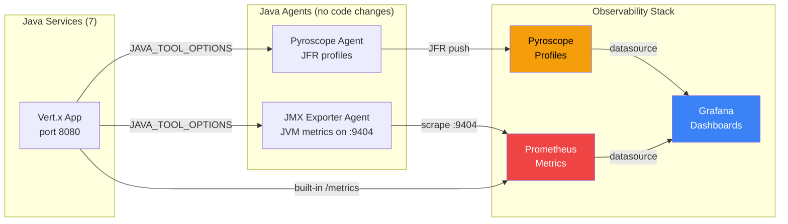
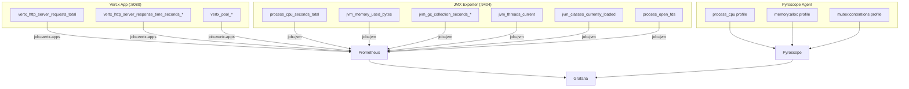

# Dashboard Reference

Reference for the five Grafana dashboards provisioned by this project.
For production debugging workflows, see [runbook.md](runbook.md). For MTTR reduction and incident workflows, see [mttr-guide.md](mttr-guide.md).
For ad-hoc Prometheus queries, see [sample-queries.md](sample-queries.md).

Grafana version: 11.5.2. Dashboard URLs are printed in the run script banner.

---

## Architecture Overview

Data flows from Java services through two agents into three backends, with zero application code changes:



### Prometheus Jobs

| Job | Port | Metrics | Source |
|-----|------|---------|--------|
| `vertx-apps` | 8080 | HTTP request counts, response times, pool stats | Vert.x Micrometer (built into app) |
| `jvm` | 9404 | Heap, GC, threads, CPU, classloading, file descriptors | JMX Exporter agent (no code changes) |

### Pyroscope Profile Types

| Profile Type ID | What it captures |
|----------------|-----------------|
| `process_cpu:cpu:nanoseconds:cpu:nanoseconds` | Which methods consume CPU time |
| `memory:alloc_in_new_tlab_bytes:bytes:space:bytes` | Where memory is allocated |
| `memory:alloc_in_new_tlab_objects:count:space:bytes` | How many objects are allocated |
| `mutex:contentions:count:mutex:count` | Which synchronized blocks cause contention |
| `mutex:delay:nanoseconds:mutex:count` | How long threads wait on mutexes |

---

## Dashboard 1: Pyroscope Java Overview

Primary profiling dashboard. Shows CPU, memory, and mutex flame graphs for any service, plus correlated JVM and HTTP metrics.

### Panels

| Panel | Data Source | What to look for |
|-------|-----------|-----------------|
| CPU Profile (flame graph) | Pyroscope | Wide bars = methods using most CPU. Look for your code, not JDK internals |
| Memory Allocation (flame graph) | Pyroscope | Wide bars = methods allocating most memory. Drives GC pressure |
| Mutex Contention (flame graph) | Pyroscope | Wide bars = synchronized blocks causing thread contention |
| Profile Comparison | Pyroscope | Compare different profile types via the `profile_type` dropdown |
| JVM CPU Usage | Prometheus (`jvm`) | Should correlate with CPU flame graph — spikes mean hot code running |
| JVM Heap Memory Used | Prometheus (`jvm`) | Sawtooth pattern = healthy GC. Flat line at max = memory leak |
| GC Collection Duration Rate | Prometheus (`jvm`) | Spikes here + allocation flame graph = GC pressure |
| HTTP Request Rate | Prometheus (`vertx-apps`) | Traffic volume driving the profiles |
| Top Functions (CPU) | Pyroscope | Table view of hottest functions |

### Template Variables

| Variable | Values | Default |
|----------|--------|---------|
| `application` | Any `bank-*` service | `bank-api-gateway` |
| `profile_type` | CPU, memory allocation, mutex contention | CPU |
| `comparison_range` | Time range for profile diff views | — |

### When to Use

Use this dashboard to investigate which methods consume the most CPU, find memory allocation hotspots driving GC pauses, identify lock contention in concurrent code, or compare profile shapes before and after a deployment.

---

## Dashboard 2: JVM Metrics Deep Dive

Detailed JVM runtime health. All data comes from the JMX Exporter agent (zero code changes).

### Panels

| Panel | Metric | What to look for |
|-------|--------|-----------------|
| Process CPU Usage | `process_cpu_seconds_total` | Per-instance CPU rate. High = check CPU flame graph |
| System CPU Usage (gauge) | `process_cpu_seconds_total` | Aggregate — above 0.8 = overloaded |
| Open File Descriptors | `process_open_fds` | Should be stable. Rising = resource leak |
| Heap Memory Used | `jvm_memory_used_bytes{area="heap"}` | Sawtooth = normal GC. Compare used vs max |
| Non-Heap Memory Used | `jvm_memory_used_bytes{area="nonheap"}` | Metaspace + code cache. Rising = classloader leak |
| GC Collection Duration (rate) | `jvm_gc_collection_seconds_sum` | Time spent in GC per second. Above 0.05 = investigate |
| GC Collection Count (rate) | `jvm_gc_collection_seconds_count` | GC frequency. Many minor GCs = normal. Major GCs = concerning |
| Live Threads | `jvm_threads_current/daemon/peak` | Stable = good. Rising = thread leak |
| Classes Loaded | `jvm_classes_currently_loaded` | Should plateau after startup. Rising = classloader leak |
| Process Uptime | `process_start_time_seconds` | How long since JVM started. Useful for restart detection |
| Memory Pool Utilization | `jvm_memory_pool_used_bytes / max` | Per-pool %. Eden full = normal. Old Gen > 80% = investigate |

### Template Variables

| Variable | Values | Default |
|----------|--------|---------|
| `instance` | Service instances (multi-select) | All |
| `interval` | Scrape aggregation window | 10s, 30s, 1m, 5m |

---

## Dashboard 3: HTTP Performance

HTTP traffic analysis. All data comes from Vert.x Micrometer metrics (built into the app, `vertx-apps` job).

### Panels

| Panel | Metric | What to look for |
|-------|--------|-----------------|
| Request Rate by Endpoint | `vertx_http_server_requests_total` | Which endpoints get the most traffic |
| Request Rate by Instance | Same, grouped by instance | Load distribution across services |
| Total Requests (counter) | Same, raw counter | Absolute request counts per service |
| Average Latency by Endpoint | `response_time_seconds_sum / count` | Which endpoints are slow on average |
| Max Latency by Endpoint | `response_time_seconds_max` | Worst-case latency spikes per endpoint |
| Error Rate (5xx) | Requests with `code=~"5.."` | Any 5xx = investigate immediately |
| Response Status Distribution | Pie chart of status codes | Should be nearly 100% 200s |
| Slowest Endpoints (bar gauge) | Top 10 by avg latency | Quick visual of bottlenecks |

### Template Variables

| Variable | Values | Default |
|----------|--------|---------|
| `instance` | Service instances (multi-select) | All |
| `method` | HTTP method (GET, POST, etc.) | All |

---

## Dashboard 4: Service Comparison

Side-by-side comparison of API Gateway vs Order Service across all dimensions — CPU, memory, GC, threads, HTTP, and flame graphs.

### Panels

| Panel | What it compares |
|-------|-----------------|
| CPU | Process CPU usage for both services |
| Heap Used | JVM heap memory consumption |
| GC Pause Rate | GC collection duration rate |
| Thread Count | Live threads |
| Request Rate | HTTP requests/sec |
| Avg Latency | Mean response time |
| CPU Profile (API Gateway) | Flame graph — where API Gateway spends CPU |
| CPU Profile (Order Service) | Flame graph — where Order Service spends CPU |

---

## Dashboard 5: Before vs After Fix

Compares flame graphs from before and after applying performance optimizations (`OPTIMIZED=true`). Use with `bash scripts/run.sh` (default pipeline runs both phases) or `bash scripts/run.sh compare` on a running stack.

### Panels

| Panel | Data Source | What to look for |
|-------|-----------|-----------------|
| Instructions | — | How to use the dashboard, what each fix changes |
| Before Fix (flame graph) | Pyroscope | Flame graph from unoptimized phase — look for wide frames |
| After Fix (flame graph) | Pyroscope | Same service after fixes — frames should be narrower |
| Top Functions — CPU | Pyroscope | Table of CPU-hottest functions |
| Top Functions — Allocation | Pyroscope | Table of allocation-heaviest functions |
| CPU — All Services | Prometheus (`jvm`) | CPU usage across all 7 services over time |
| Heap Used — All Services | Prometheus (`jvm`) | Heap consumption across all 7 services |

### Template Variables

| Variable | Values | Default |
|----------|--------|---------|
| `application` | All 7 `bank-*` services | `bank-api-gateway` |
| `profile_type` | CPU, Alloc (bytes/objects), Mutex (contentions/delay), Wall Clock | CPU |

### When to Use

Use this dashboard to verify that performance fixes actually reduced CPU/allocation/lock overhead. Compare frame widths between Before and After panels for the same service and profile type.

---

## Troubleshooting: No Data

### Pyroscope panels (flame graphs) show nothing

1. Verify Pyroscope is running: `curl http://localhost:4040/ready`
2. Verify profiles exist:
   ```bash
   curl -s 'http://localhost:4040/querier.v1.QuerierService/LabelValues' \
     -X POST -H 'Content-Type: application/json' -d '{"name":"service_name"}'
   ```
   Should list all 7 `bank-*` services.
3. Confirm the `application` dropdown has a value selected (not empty).
4. Set the time range to cover when load was generated (e.g., "Last 1 hour").
5. Profiles are empty without HTTP traffic — run the load generator first.

### Prometheus panels (timeseries) show nothing

1. Check which job the panel uses (hover panel title, click Edit, look at `job=`):
   - `job="jvm"` — JMX Exporter metrics (heap, CPU, GC, threads)
   - `job="vertx-apps"` — Vert.x HTTP metrics (request rate, latency)
2. Verify targets are up:
   ```bash
   curl -s 'http://localhost:9090/api/v1/query?query=up' | python3 -m json.tool
   ```
3. Verify the specific metric exists:
   ```bash
   curl -s 'http://localhost:9090/api/v1/query?query=jvm_memory_used_bytes' | \
     python3 -c "import json,sys; print(len(json.load(sys.stdin)['data']['result']), 'series')"
   ```
4. If 0 series, the JMX exporter may not be running — check container logs:
   ```bash
   docker logs api-gateway 2>&1 | grep -i "jmx\|exporter\|9404"
   ```

### Explore Profiles shows "plugin not installed"

The Pyroscope app plugin (`grafana-pyroscope-app`) must be both installed and enabled. This project handles both automatically:

- **Installation:** `GF_INSTALL_PLUGINS=grafana-pyroscope-app` in `docker-compose.yaml`
- **Activation:** `config/grafana/provisioning/plugins/plugins.yaml` enables the app on startup

If you still see the error after a fresh deploy, the Grafana volume may be caching old state. Tear down and redeploy:

```bash
bash scripts/run.sh teardown
bash scripts/run.sh
```

### Grafana volume caching old dashboards

If dashboard JSON was updated but Grafana still shows old versions, the Docker volume is stale. Tear down and redeploy:

```bash
bash scripts/run.sh teardown
bash scripts/run.sh
```

---

## Metric Sources


