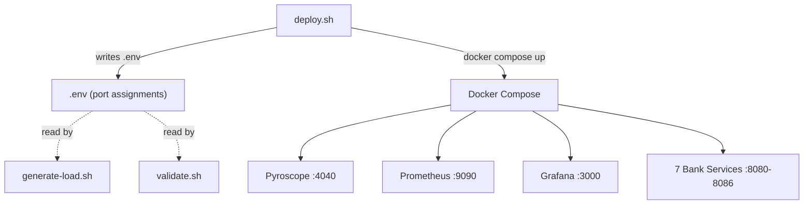
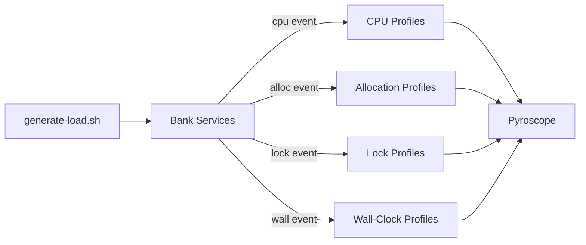
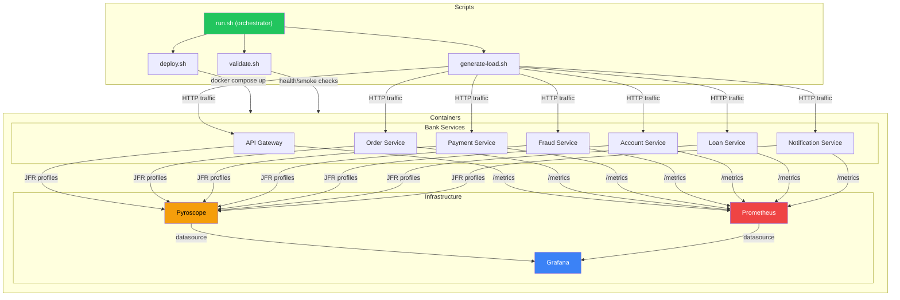

# Pipeline Documentation

Stages, data flow, and configuration for the Pyroscope bank demo pipeline.

## Overview

Four stages, executed sequentially:


| Stage | Script | What it does |
|-------|--------|-------------|
| **Deploy** | `scripts/deploy.sh` | Builds images, resolves ports, starts 10 containers, waits for health |
| **Generate Load** | `scripts/generate-load.sh` | Sends weighted HTTP traffic to all 7 services |
| **Validate** | `scripts/validate.sh` | Checks infrastructure, services, dashboards, endpoints (36 checks) |
| **Data Ready** | (built into `run.sh`) | Polls Pyroscope and Prometheus until profile and metric data are confirmed |

Optional stages: `benchmark` (overhead measurement), `teardown` (cleanup).

## Running the Pipeline

### Shell scripts (requires only bash + curl)

```bash
# Full pipeline: deploy -> load -> validate -> data check (quiet mode with spinners)
bash scripts/run.sh

# Full pipeline, verbose output
bash scripts/run.sh --verbose

# Full pipeline, save stage logs to disk
bash scripts/run.sh --log-dir /tmp/pyroscope-logs

# Individual stages (always verbose)
bash scripts/run.sh deploy
bash scripts/run.sh load 120
bash scripts/run.sh validate

# Custom load duration for full pipeline
bash scripts/run.sh --load-duration 60

# Other commands
bash scripts/run.sh benchmark           # profiling overhead test
bash scripts/run.sh teardown            # stop + clean up
```

**Quiet mode (default):** Shows a single-line spinner per stage with elapsed time. On completion, a "Ready" banner prints with Grafana/Pyroscope URLs. Sub-script output goes to `/dev/null`. Use `--log-dir DIR` to save logs, or `--verbose` for inline output.

**Individual commands** (`deploy`, `load`, `validate`, `top`, `health`) always run verbose.

Call the underlying scripts directly if preferred:

```bash
bash scripts/deploy.sh
bash scripts/generate-load.sh 120
bash scripts/validate.sh
bash scripts/teardown.sh
```

## Stage 1: Deploy

Builds the Docker image, checks port availability (auto-remaps conflicts), starts all 10 containers (3 infrastructure + 7 bank services), and waits for each to report healthy.

The observability stack (Pyroscope, Prometheus, Grafana) must be running before services start. Services push JFR profiles and expose `/metrics` on startup; if Pyroscope is not ready, early profiles are lost.

**Data flow:**



**The `.env` contract:** `deploy.sh` writes port assignments to `.env` at the project root. All downstream scripts source this file to discover actual ports. If ports were remapped due to conflicts, `.env` reflects the remapped ports, not the defaults.

**Port resolution:** Default ports are `4040`, `9090`, `3000`, `18080-18086`. If any port is occupied, `deploy.sh` scans upward (up to +100) for the next free port and records the result in `.env`.

## Stage 2: Generate Load

Sends continuous HTTP requests to all 7 bank services for a configurable duration (default 120s via the pipeline runner, 300s standalone).

Pyroscope needs active JFR data to build flame graphs. Prometheus needs request metrics to populate dashboards. Without traffic, both are empty.

**Weighted distribution:**

| Weight | Endpoints | Example |
|--------|-----------|---------|
| 60% (light) | `/health`, `/redis/get`, `/json/process` | Fast, low-CPU |
| 30% (medium) | `/cpu`, `/alloc`, `/db/select` | Moderate CPU/memory |
| 10% (heavy) | `/batch/process`, `/downstream/fanout` | High CPU, long latency |

The distribution produces a realistic flame graph mix rather than pure hot-path saturation.

**Profile type coverage:** Each service's endpoints exercise different JFR event types:



- **CPU:** fibonacci, BigDecimal math, regex engines, Monte Carlo
- **Allocation:** batch processing, template rendering, map construction
- **Lock:** synchronized blocks in Order/Payment/Account services
- **Wall-clock:** simulated I/O waits, downstream calls, sleep-based backoff

## Stage 3: Validate

Runs 36 automated checks across 11 categories to verify the entire stack is operational.

**11 check categories:**

| # | Category | Checks | Type |
|---|----------|--------|------|
| 1 | Infrastructure | Pyroscope, Prometheus, Grafana readiness | PASS/FAIL |
| 2 | Bank Services | 7 service health endpoints | PASS/FAIL |
| 3 | Grafana Dashboards | 4 dashboard UIDs exist | PASS/FAIL |
| 4 | Pyroscope Profiles | 3 services appear in label values | PASS/WARN |
| 5 | API Gateway Endpoints | 5 endpoint smoke tests | PASS/FAIL |
| 6 | Order Service | 2 endpoint smoke tests | PASS/FAIL |
| 7 | Payment Service | 3 endpoint smoke tests | PASS/FAIL |
| 8 | Fraud Service | 3 endpoint smoke tests | PASS/FAIL |
| 9 | Account Service | 3 endpoint smoke tests | PASS/FAIL |
| 10 | Loan Service | 3 endpoint smoke tests | PASS/FAIL |
| 11 | Notification Service | 3 endpoint smoke tests | PASS/FAIL |

**PASS/WARN/FAIL semantics:**
- **PASS:** endpoint returned HTTP 200 within the timeout
- **WARN:** expected data not yet available (e.g., Pyroscope profiles need more load time) -- not a failure
- **FAIL:** endpoint unreachable or returned an error -- broken service

## Optional Stages

### Benchmark

```bash
bash scripts/run.sh benchmark
bash scripts/benchmark.sh 500 100    # 500 requests, 100 warmup
```

Measures profiling overhead by running each service endpoint twice -- once with the Pyroscope agent, once without -- and comparing average latency, p50/p95/p99, and throughput. Results are saved to `benchmark-results/`.

### Teardown

```bash
bash scripts/run.sh teardown
bash scripts/teardown.sh
```

Stops and removes all containers, networks, and volumes.

## Configuration

### `.env` variables

All ports are auto-generated by `deploy.sh`. Create `.env` manually before deploying to force specific ports.

| Variable | Default | Description |
|----------|---------|-------------|
| `PYROSCOPE_PORT` | 4040 | Pyroscope server |
| `PROMETHEUS_PORT` | 9090 | Prometheus server |
| `GRAFANA_PORT` | 3000 | Grafana server |
| `API_GATEWAY_PORT` | 18080 | API Gateway |
| `ORDER_SERVICE_PORT` | 18081 | Order Service |
| `PAYMENT_SERVICE_PORT` | 18082 | Payment Service |
| `FRAUD_SERVICE_PORT` | 18083 | Fraud Service |
| `ACCOUNT_SERVICE_PORT` | 18084 | Account Service |
| `LOAN_SERVICE_PORT` | 18085 | Loan Service |
| `NOTIFICATION_SERVICE_PORT` | 18086 | Notification Service |

### How stages share state

1. **`.env` file** -- `deploy.sh` writes port assignments; all other scripts read them
2. **Running containers** -- `generate-load.sh` and `validate.sh` assume containers are already running (started by deploy)

No database, message queue, or other shared state exists between stages.

## Data Flow Diagram


