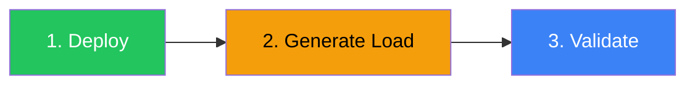
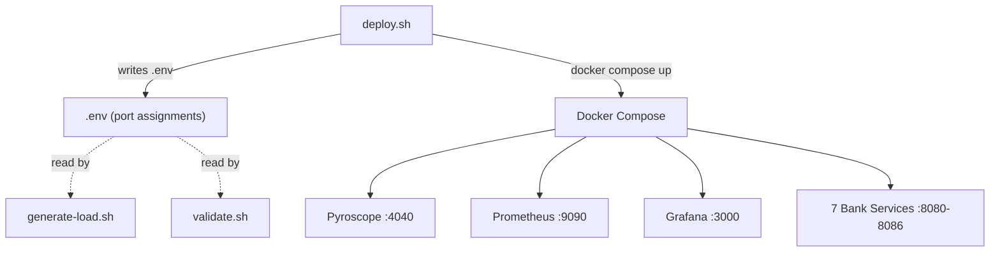
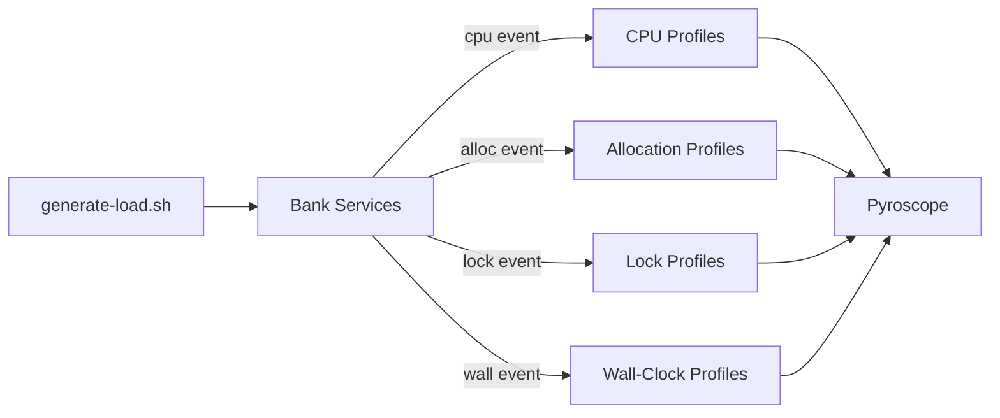
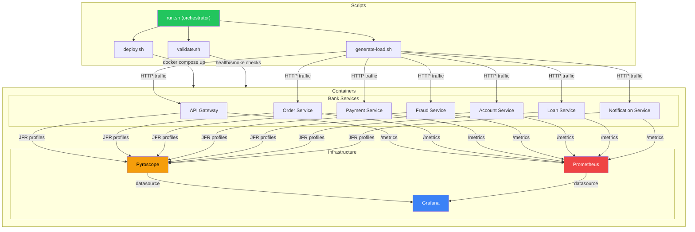

# Pipeline Documentation

How the Pyroscope bank demo pipeline works — stages, data flow, and configuration.

## Overview

The pipeline has three core stages. Each must complete before the next begins.



| Stage | Script | What it does |
|-------|--------|-------------|
| **Deploy** | `scripts/deploy.sh` | Builds images, resolves ports, starts 10 containers, waits for health |
| **Generate Load** | `scripts/generate-load.sh` | Sends weighted HTTP traffic to all 7 services |
| **Validate** | `scripts/validate.sh` | Checks infrastructure, services, dashboards, endpoints (36 checks) |

Optional stages: `benchmark` (overhead measurement), `teardown` (cleanup), `attach-to-existing-jvm` (external JVM profiling).

## Running the Pipeline

Two equivalent methods are provided. Both produce the same result — choose based on what you have installed.

### Shell scripts (recommended — requires only bash + curl)

```bash
# Full pipeline: deploy → 2 min load → validate
bash scripts/run.sh

# Individual stages
bash scripts/run.sh deploy
bash scripts/run.sh load 120
bash scripts/run.sh validate

# Custom load duration for full pipeline
bash scripts/run.sh --load-duration 60

# Other commands
bash scripts/run.sh benchmark           # profiling overhead test
bash scripts/run.sh teardown            # stop + clean up
```

You can also call the underlying scripts directly:

```bash
bash scripts/deploy.sh
bash scripts/generate-load.sh 120
bash scripts/validate.sh
bash scripts/teardown.sh
```

### Ansible (requires ansible + community.docker collection)

Use this path if you need remote host deployment or already use Ansible for automation.

```bash
# One-time setup
cd ansible
ansible-galaxy collection install community.docker

# Full pipeline
ansible-playbook -i inventory.yml pipeline.yml

# Individual stages via tags
ansible-playbook -i inventory.yml pipeline.yml --tags deploy
ansible-playbook -i inventory.yml pipeline.yml --tags load
ansible-playbook -i inventory.yml pipeline.yml --tags validate

# Custom load duration
ansible-playbook -i inventory.yml pipeline.yml --tags load -e duration=60

# Teardown
ansible-playbook -i inventory.yml teardown.yml
```

To target a remote host, edit `ansible/inventory.yml` and replace `localhost` with your target hostname.

## Stage 1: Deploy

**What:** Builds the Docker image, checks port availability (auto-remaps conflicts), starts all 10 containers (3 infrastructure + 7 bank services), and waits for each to report healthy.

**Why:** The observability stack (Pyroscope, Prometheus, Grafana) must be running before services start, because services push JFR profiles and expose `/metrics` on startup. If Pyroscope is not ready, early profiles are lost.

**Data flow:**



**The `.env` contract:** `deploy.sh` writes port assignments to `.env` at the project root. All downstream scripts source this file to discover actual ports. If ports were remapped due to conflicts, the `.env` values reflect the remapped ports — not the defaults.

**Port resolution:** Default ports are `4040`, `9090`, `3000`, `18080-18086`. If any port is occupied, `deploy.sh` scans upward (up to +100) for the next free port and records the result in `.env`.

## Stage 2: Generate Load

**What:** Sends continuous HTTP requests to all 7 bank services for a configurable duration (default 120s in the pipeline runner, 300s standalone).

**Why:** Pyroscope needs active JFR data to build flame graphs. Without traffic, profiles are empty. Prometheus also needs request metrics to populate dashboards and potentially trigger alert rules.

**Weighted distribution:**

| Weight | Endpoints | Example |
|--------|-----------|---------|
| 60% (light) | `/health`, `/redis/get`, `/json/process` | Fast, low-CPU |
| 30% (medium) | `/cpu`, `/alloc`, `/db/select` | Moderate CPU/memory |
| 10% (heavy) | `/batch/process`, `/downstream/fanout` | High CPU, long latency |

This distribution ensures flame graphs show a realistic mix — not just hot-path saturation.

**Profile type coverage:** Each service's endpoints are designed to exercise different JFR event types:



- **CPU:** fibonacci, BigDecimal math, regex engines, Monte Carlo
- **Allocation:** batch processing, template rendering, map construction
- **Lock:** synchronized blocks in Order/Payment/Account services
- **Wall-clock:** simulated I/O waits, downstream calls, sleep-based backoff

## Stage 3: Validate

**What:** Runs 36 automated checks across 11 categories to verify the entire stack is operational.

**Why:** After deploy + load, you need confidence that all services responded, dashboards are provisioned, and Pyroscope received profiles. A single failing service can silently invalidate a demo.

**11 check categories:**

| # | Category | Checks | Type |
|---|----------|--------|------|
| 1 | Infrastructure | Pyroscope, Prometheus, Grafana readiness | PASS/FAIL |
| 2 | Bank Services | 7 service health endpoints | PASS/FAIL |
| 3 | Grafana Dashboards | 4 dashboard UIDs exist | PASS/FAIL |
| 4 | Pyroscope Profiles | 3 services appear in label values | PASS/WARN |
| 5 | API Gateway Endpoints | 5 endpoint smoke tests | PASS/FAIL |
| 6 | Order Service | 2 endpoint smoke tests | PASS/FAIL |
| 7 | Payment Service | 3 endpoint smoke tests | PASS/FAIL |
| 8 | Fraud Service | 3 endpoint smoke tests | PASS/FAIL |
| 9 | Account Service | 3 endpoint smoke tests | PASS/FAIL |
| 10 | Loan Service | 3 endpoint smoke tests | PASS/FAIL |
| 11 | Notification Service | 3 endpoint smoke tests | PASS/FAIL |

**PASS/WARN/FAIL semantics:**
- **PASS:** endpoint returned HTTP 200 within the timeout
- **WARN:** expected data not yet available (e.g., Pyroscope profiles need more load time) — not a failure
- **FAIL:** endpoint unreachable or returned an error — indicates a broken service

## Optional Stages

### Benchmark

```bash
bash scripts/run.sh benchmark
bash scripts/benchmark.sh 500 100    # 500 requests, 100 warmup
```

Measures profiling overhead by running each service endpoint twice — once with the Pyroscope agent, once without — and comparing average latency, p50/p95/p99, and throughput. Results are saved to `benchmark-results/`.

### Teardown

```bash
bash scripts/run.sh teardown
bash scripts/teardown.sh
```

Stops and removes all containers, networks, and volumes. Run this to free resources after a demo.

### Attach to JVM

```bash
bash scripts/attach-to-existing-jvm.sh
```

Attaches the Pyroscope agent to an already-running JVM process outside Docker.

## Configuration

### `.env` variables

All ports are auto-generated by `deploy.sh`. You can also create `.env` manually before deploying to force specific ports.

| Variable | Default | Description |
|----------|---------|-------------|
| `PYROSCOPE_PORT` | 4040 | Pyroscope server |
| `PROMETHEUS_PORT` | 9090 | Prometheus server |
| `GRAFANA_PORT` | 3000 | Grafana server |
| `API_GATEWAY_PORT` | 18080 | API Gateway |
| `ORDER_SERVICE_PORT` | 18081 | Order Service |
| `PAYMENT_SERVICE_PORT` | 18082 | Payment Service |
| `FRAUD_SERVICE_PORT` | 18083 | Fraud Service |
| `ACCOUNT_SERVICE_PORT` | 18084 | Account Service |
| `LOAN_SERVICE_PORT` | 18085 | Loan Service |
| `NOTIFICATION_SERVICE_PORT` | 18086 | Notification Service |

### How stages share state

Stages communicate through two mechanisms:

1. **`.env` file** — `deploy.sh` writes port assignments; all other scripts read them
2. **Running containers** — `generate-load.sh` and `validate.sh` assume containers are already running (started by deploy)

There is no database, message queue, or other shared state between stages.

## Data Flow Diagram


